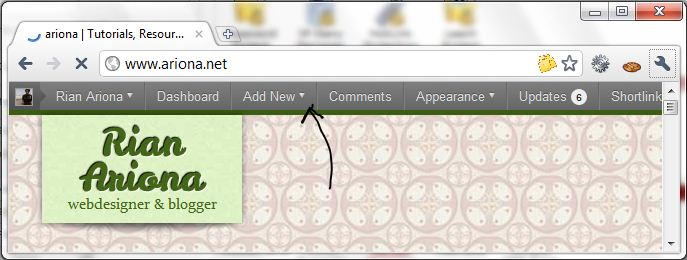
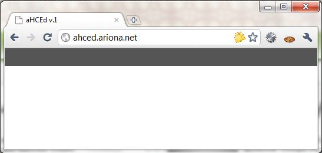
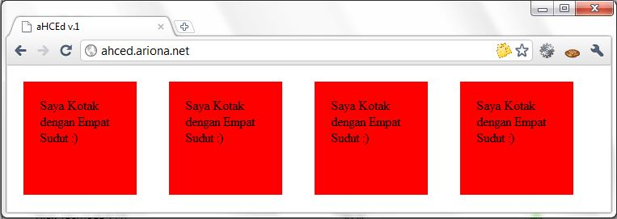
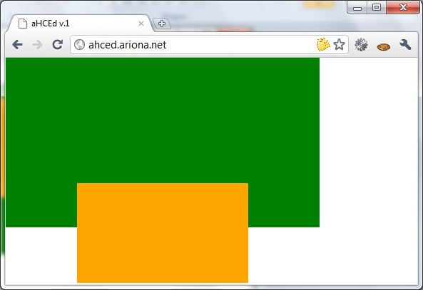
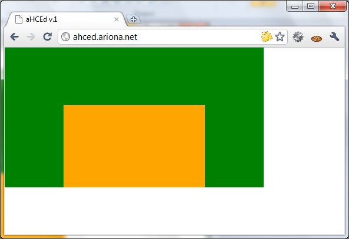
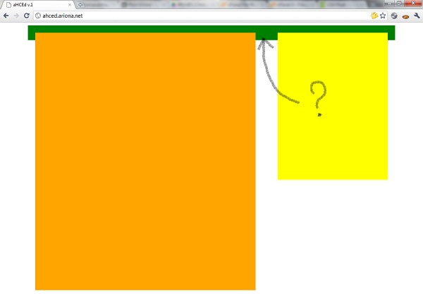

Dulu, sebelum saya mengerti CSS, saya selalu mencari berbagai referensi yang berhubungan dengan CSS dan HTML. jika hanya mengandalkan membaca dari referensi tersebut saya rasa saya masih belum bisa untuk membuat desain web mandiri. Kadang masih bingung, apa yang harus dilakukan selanjutnya.

Tidak cukup hanya dengan membaca dan tahu, bagi anda yang ingin belajar CSS / webdesign, anda harus membuat kasus sendiri, latihan menggunakan berbagai property dan value dari CSS atau tag dan attribut dari HTML agar pada akhirnya anda mengerti sendiri untuk apa semuanya.  
Berikut ini adalah 5 permasalahan bagi seorang CSS Newbie (yang masih belum tau apa-apa tentang CSS) yang sering ditemukan, termasuk oleh saya dulu. :).

### Masalah ke-1 : CSS Reset

Sewaktu latihan CSS, saya berniat untuk membuat bar yang berada di atas halaman web, seperti pada gambar berikut ini.



Wordpress top bar

Lalu saya buat sebuah div dengan id topbar,dan Dengan gesitnya :) saya langsung menerapkan style seperti berikut :).

```css
#topbar{
    width:100%;
    height:30px;
    background:#333;
}
```

saya save dan langsung melihat previewnya di browser. yes topbarnya udah diatas, tingginya bener, lebarnya udah bener 100%, tapi kok serasa ada yang mengganjal :(. apaa yah.. ?


Jarak dari content web ke browser window

Ada jarak !!??, gimana nih. coba pake `margin:0` juga g mau nempel tuh topbar. :(

#### Solusi

Untuk kasus diatas, anda harus mengerti apa yang sebenarnya terjadi. hal ini terjadi karena setiap browser memiliki css defaultnya masing-masing. file css bawaan ini akan diterapkan disetiap halaman web yang di load pada browser.

Pernahkan anda bertanya, dari mana datangnya besar huruf H1 sampai H6?, atau jarak antara Ul atau Ol, atau kenapa tag i bisa miring, tag b bisa tebal dan seterusnya dan seterusnya?.

Untuk itulah CSS reset hadir. CSS reset digunakan untuk mereset ulang nilai-nilai yang telah diterapkan pada file CSS bawaan browser.  
sekarang coba anda tambahkan, baris style berikut :

```css
* {
    margin:0; 
    padding:0;
}
```

Tanda bintang (\*) adalah selector untuk semua element html, sama halnya dengan memberikan style pada html.



Jarak dari content ke browser window hilang

> If "Reset" sounds complicated, don't worry. it's quite simple. Mostly it involves zeroing out margins and padding.
> 
> Jeffrey Way

Dan liat apa yang terjadi, kini topbarnya merapat ke sisi browser :). CSS Reset tidak hanya itu, jika anda ingin memulai memformat halaman web dari awal berari anda juga harus mereset seluruh value dari setiap property yang ada menjadi normal.

Jika anda malas, mereset seluruh property setiap tag, gunakan CSS Reset dari pihak ketiga. contohnya.

- [Yahoo UI (YUI) CSS Reset](http://developer.yahoo.com/yui/reset/)
- [Meyer Web CSS Reset](http://meyerweb.com/eric/tools/css/reset/)

### Masalah ke-2 : ID dan Class

Ketika membuat markup HTML ada attribut ID ada juga Class, keduanya digunakan untuk menandai suatu tag. yang menjadi pertanyaan adalah, apa bedanya ID dan Class ? toh keduanya digunakan untuk menandai tag. Untuk memahami apa perbedaan antara ID dan Class, kita analogikan dengan Manusia. siap?

ID digunakan untuk menandai suatu tag, katakanlah ID itu Nama seseorang, misalnya "Rian" atau "Ariona", nama digunakan untuk membedakan antara satu sama lain. dan tidak boleh ada sama (meskipun ada nama yang sama). sedangkan Class bisa kita analogikan dengan manusia, mau "Rian", mau "Ariona", mau "Ahmad" semuanya memiliki Class sejenis yaitu Manusia. _mulai ngeh ??_.

Dalam sebuah markup, tidak boleh terdapat dua atau lebih ID yang sama, misalnya :

```html
<div id="judul">
    <ul id="judul">
       <li>item1</li>
    </ul>
</div>
<h1 id="judul">Ini Ibu Budi</h1>
```

ID hanya boleh digunakan satu kali karena sifatnya yang unik. (meskipun pada browser modern, hal ini tidak menjadi masalah. tapi hal ini sangatlah salah).

Jika suatu markup memiliki karakteristik yang sama, misalnya warnanya sama , ukuran hurufnya sama, jenis hurufnya sama. maka gunakanlah Class sebagai penanda. misalnya :

```html
<div class="merah">
    <h1>Judul Blog</h1>
</div>
<blockquote class="merah">Demi masa!</blockquote>
```

Class "merah" dapat digunakan berkali-kali dalam markup, karena karakteristiknya yang sama, yaitu memiliki background merah.

```css
.merah{
    background:red;
}
```

### Masalah ke-3 : Margin dan Padding?

Masalah ketiga adalah, apa sih bedanya Margin dan Padding??, keduanya kan digunakan untuk memberikan Jarak.  
Perbedaanya terletak pada jarak yang diberikan. Margin memberikan jarak pada setiap element sedangkan Padding memberi jarak Antara Konten dengan Element. biar lebih _"oohh"_ kita pakai contoh :).  
Buatlah markup seperti berikut.

```html
<div class="box">Saya Kotak dengan Empat Sudut</div>
<div class="box">Saya Kotak dengan Empat Sudut</div>
<div class="box">Saya Kotak dengan Empat Sudut</div>
```

lalu berilah style seperti berikut.

```css
*{
    margin:0; padding:0;
}
.box{
    background:red;
    width:100px;
    height:100px;
    margin:20px;
    float:left;
}
```

jika di preview di browser berikut tampilannya.


Demo Margin

Kita menerapkan margin sebesar 20 pixel, dan anda dapat melihat setiap box (element) memiliki jarak antara satu sama lainnya. inilah yang dimaksud jarak antar element.

Perhatikan, teks yang ada di dalam Box, tidak ada jarak sama sekali bukan? Teks mentok ke pinggiran Box. disinilah Padding beraksi :). padding digunakan untuk memberikan jarak antara konten (teks) dengan sisi element itu sendiri. coba anda tambahkan padding pada class box sebelumnya.

```css
*{
    margin:0; padding:0;
}
.box{
    background:red;
    width:100px;
    height:100px;
    margin:20px;
    float:left;
    padding:20px;
}
```

Hasil di browser anda akan seperti berikut.



Permasalahan barupun muncul, kok, kotaknya jadi Gede?? kan saya beri ukuran 100px, kalo diukur pake mistar kok jadi lebih dari 100 :).

ini disebabkan oleh karena padding akan menambahkan jaraknya dengan ukuran element itu sendiri. misalnya paddingnya 20px dan width dari box 100px maka ukuran akhir box adalah, 140 X 140px. selain padding, yang mempengaruhi ukuran dari box adalah border, perhatikan diagram berikut.


Lalu bagaimana solusinya agar ukuran box selalu sama meskipun kita menambahkan padding. Cara pertama adalah dengan menentukan ukuran width dan height terlebih dahulu, lalu dikurangi padding yang akan ditambahkan.  
cara kedua adalah menerapkan padding pada child, bukan pada parentnya langsung. misalnya:

```html
<div class="box">
    <div class="content">Ini Ibu Budi</div>
</div>
```

kita berikan padding pada Class Content, jadi ukuran box masih tetap sama :).

Masih semangat membaca?? Lanjuut!! :)


### Masalah ke-4 : Relative atau Absolute?

Ini yang memang membingungkan. apa sih bedanya Relative dan Absolute??  
Untuk menjelaskan perbedaan Relative dan Absolute kita langsung ke contoh kasus. buatlah markup seperti berikut ini:

```html
<div class="satu">
    <div class="dua"></div>
</div>
```

lalu beri style seperti berikut.

```css
*{
    margin:0;padding:0; /* CSS Reset */
}
.satu{
    width:400px;
    height:200px;
    background:green;
    padding:20px;
}
.dua{
    width:200px;
    height:100px;
    background:orange;
    padding:20px;
}
```

jika ditampilkan di browser tampilannya akan menjadi seperti berikut.


Setiap element secara default memiliki position static, ketika position bernilai static anda tidak dapat menentukan jarak satu element dengan element lain menggunakan property Top, Bottom, Left, atau Right. sebagai contoh, tambahkan property left:100px; di class .dua , maka tidak akan terjadi perubahan sama sekali.

```css
.dua{
    width:200px;
    height:100px;
    background:orange;
    padding:20px;
    left:100px;
}
```

Untuk itu kita perlu menset position menjadi relative, dengan begitu class dua akan bergeser 100px dari kiri.

```css
.dua{
    width:200px;
    height:100px;
    background:orange;
    padding:20px;
    left:100px;
    position:relative;
}
```


Dengan menambahkan position:relative anda dapat menentukan posisi suatu elemen berada. lalu bagaimana dengan Absolute ?.

Absolute position akan mengeluarkan elemen tersebut dari parentnya (.satu). jika anda perhatikan, sebelumnya kita menambahkan 100px dari kiri, 100px ini dihitung/dimulai dari box .Satu, bukan dihitung dari ujung browser. dengan menambahkan position absolute, 100px akan ditambahkan mulai dari element terdekat yang memiliki position:relative, dalam kasus ini adalah browser itu sendiri.

```css
.dua{
    width:200px;
    height:100px;
    background:orange;
    padding:20px;
    left:100px;
    position:absolute;
}
```


jika anda masih belum mengerti, silahkan tambahkan properti bottom dengan nilai 0 (bottom:0;), maka box akan menempel ke bawah browser, karena kita menentukan jarak dari bawah dengan 0px.

```css
.dua{
    width:200px;
    height:100px;
    background:orange;
    padding:20px;
    left:100px;
    bottom:0;
    position:absolute;
}
```



lain halnya jika kita menambahkan position:relative pada box .satu, maka box .dua akan menempel dibawah box .satu.

```css
.satu{
    width:400px;
    height:200px;
    background:green;
    padding:20px;
    position:relative;
}
```



### Masalah ke-5 : Float

> "CSS is easy. Anyone can do it!". it may not be rocket science, but CSS is Powerful enough to make you rip your hair out.
> 
> Jeffrey Way

Property Float digunakan untuk meratakan element ke kiri atau ke kanan, untuk penggunaan biasa memang tidak menjadi masalah. jika kita ingin meratakirikan element kita tinggal menambahkan float:left, begitu juga sebaliknya. tapi ketika kita menambahkan floating pada element maka element parent akan bertingkah aneh. _(penasaran ?? )_, kita pakai suatu kasus. :).  
Misalnya kita punya sebuah Div dengan Id Container, lalu didalam div tersebut kita tambahkan dua Div dengan ID Content dan Sidebar. seperti berikut :

```html
<div id="container">
    <div id="content"></div>
    <div id="sidebar"></div>
</div>
```

Selanjutnya kita beri style seperti berikut :

```css
#container {
    width:960px;
    margin:0 auto; /* agar container berada di tengah browser*/
    padding:20px;
}
#content {
    background:orange;  
    width:600px;
    height:700px;
    float:left;
}
#sidebar{
    background:yellow;
    width:300px;
    height:400px;
    float:right;
}
```

jika ditampilkan di browser maka tampilannya seperti berikut ini :


Sekilas tidak ada yang salah bukan?, semuanya berjalan seperti seharusnya. Content berada disisi kiri, dan sidebar berada di sisi kanan. tidak ada yang salah memang, tapi sebenarnya parent dari content dan sidebar yang bermasalah. _loh kok??_ , coba anda beri background pada #container misalnya.

```css
#container {
    width:960px;
    margin:0 auto; /* agar container berada di tengah browser*/
    padding:20px;
    background:green;
}
```

apa yang terjadi?? ternyata tinggi #container tidak ikut membesar, seharusnya tinggi #container ikut membesar sesuai dengan tinggi #content bukan ? :).



sebelum ke solusi, kita tambahkan lagi satu div dengan id footer. :)

```html
<div id="container">
    <div id="content"></div>
    <div id="sidebar"></div>
    <div id="footer"></div>
</div>
```

lalu beri style seperti berikut:

```css
#footer{
    background:red;
    height:100px;
    width:100%;
}
```

Yang kita inginkan adalah footer memiliki lebar 100%, dan berada di bawah bukan? tapi yang terjadi adalah :


Memang membingungkan, Apa yang sebenarnya terjadi!!! _cetusku dalam hati_ :).

#### Solusi

**Solusi untuk #Container**  
Ada 3 cara untuk permasalahan #container agar dapat merubah tingginya secara otomatis sesuai tinggi Content.

1. **Clear:Both**  
    Anda tinggal buat sebuah Div kosong sebelum penutup div #container dan beri style clear:both seperti berikut ini :
    
    ```html
    <div id="container">
        <div id="content"></div>
        <div id="sidebar"></div>
        <div id="footer"></div>
        <div style="clear:both"></div>
    </div>
    ```
    
2. **Pseudo Class**  
    Cara ini hampir sama dengan cara pertama, hanya saja kita tidak membuat div kosong seperti cara sebelumnya, melainkan membuat pseudo class pada #container. pada file CSS anda tambahkan kode berikut
    
    ```css
    #container:after{
        clear:both;
        content:' ';
        display:block;
    }
    ```
    
3. **Overflow:Hidden**  
    Cara ini adalah cara paling sederhana, anda tinggal menambahkan overflow:hidden pada style #container. Masalahpun terpecahkan :)
    
    ```css
    #container {
        width:960px;
        margin:0 auto; /* agar container berada di tengah browser*/
        padding:20px;
        overflow:hidden;
    }
    ```
    

**Solusi untuk Footer**  
Jika anda mengerti tentang solusi sebelumnya, anda dapat menebak bukan bagaimana solusi untuk permasalahan footer ini. atau _masih bingung ?_ :), untuk masalah footer ini, cukup dengan menambahkan clear:both pada #footer :).

```css
#footer{
    background:red;
    height:100px;
    width:100%;
    clear:both;
}
```


### Kesimpulan

Itulah permasalahan-permasalahan yang sering ditemukan oleh para _"pelajar baru CSS"_, seperti saya dulu. tapi setiap ada permasalahan pasti ada solusinya :). semoga artikel singkat (< bohong) ini bermanfaat bagi anda para CSS newbie :).

#### Referensi

- From Photoshop to HTML : "How to slice your design like a pro" ([Jeffrey Way](http://jeffrey-way.com/))
- [www.w3schools.com/css/](http://www.w3schools.com/css)
- New Riders: The CSS Detective Guide (Denise Jacobs)
