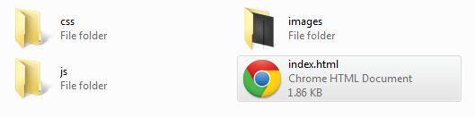

Pernah dengar CSS3 Generator? yup, itutuh yang bisa men-_generate_ kode CSS dengan menggeser [slider](/2011/08/membuat-slide-to-unlock-dengan-jquery/) atau mengisi value, kode CSSpun siap untuk di copy.

Contoh dari CSS Generator yang pernah saya temua diantaranya adalah css3generator.com , css3.me,  dan css3maker.com.

Pembuatan CSS3 generator itu tidaklah sesulit yang dibayangkan loh, dengan bantuan jQuery kita bisa membuat CSS3 Generator sendiri dan mungkin lebih bagus dari yang sudah ada .

Pada kasus yang akan kita buat kali ini adalah, pembuatan CSS3 box-shadow Generator, tanpa banyak basa-basi lagi,  Yuk kita mulai tutorialnya.

Seblumnya liat demonstrasinya yuk !

[Demonstrasi](http://demo.ariona.net/3gen/index.html) [Download](http://demo.ariona.net/3gen/3gen.zip)

## Persiapan Project CSS3 Generator

Untuk persiapan, selain secangkir kopi , kita download terlebih dahulu [jQuery ColorPicker disini](http://www.eyecon.ro/colorpicker/#about). Buat struktur folder seperti berikut biar rapih dan terstruktur.



Setelah kamu download jQuery ColorPicker, Copy seluruh image yang terdapat di dalam folder Images ColorPicker ke folder Images proyek kita. copy juga file colorpicker.css ke folder css dan colorpicker.js ke folder js.

## HTML

Untuk markup pertama-tama kita mulai dari Head, kita akan menggunakan [jQuery](/category/tutorials/javascript/), jQueryUI, dan jQuery ColorPicker, disini saya akan mengambil file jQuery dan jQueryUI langsung dari CDN nya google .

```html
<head>
    <title>CSS3 Generator</title>;
    <link rel="stylesheet" type="text/css" href="css/style.css />
    <link rel="stylesheet" type="text/css" href="css/colorpicker.css" />
    <link rel="stylesheet" type="text/css" href="http://ajax.googleapis.com/ajax/libs/jqueryui/1.8.16/themes/base/jquery-ui.css" media="all" />
    <script src="http://ajax.googleapis.com/ajax/libs/jquery/1.6.2/jquery.min.js"></script>
    <script src="http://ajax.googleapis.com/ajax/libs/jqueryui/1.8.16/jquery-ui.min.js"></script>
    <script src="http://js/colorpicker.js"></script>
    <script src="http://js/gen.js"></script>
</head>
```

File style.css adalah file css yang akan kita buat, sedangkan jquery-ui.css adalah CSS bawaan untuk jQueryUI, dan file gen.js adalah file [javascript](/category/tutorials/javascript/) yang akan kita buat nanti untuk script men-generate CSS3.

Selanjutnya untuk markup Generator dan hasil Generate kita buat markupnya seperti berikut :

```html
<div id="wrapper">
    <div id="generator">
        <p>Offset X, menggeser Shadow secara horizontal</p>
        <div id="offsetX" class="slider"></div>
        <p>Offset Y, menggeser Shadow secara vertical</p>
        <div id="offsetY" class="slider"></div>
        <p>Blur Radius, Nilai kebiasan dari Shadow</p>
        <div id="Blur" class="slider"></div>
        <p>Color, Warna dari Shadow itu sendiri</p>
        <input type="text" value="#333333" id="color">
    </div>
    <div id="result">
        <div class="box"></div>
    </div>
</div>
```

.slider akan kita rubah menjadi jQuery Slider dan .box adalah element yang akan kita buat sebagai preview dari CSS3 box-shadow generator yang akan kita buat. oke, markup beres lanjut ke CSS.

## CSS

Buat file CSS baru dan simpan di folder css yang telah kita buat sebelumnya. lalu kita mulai memberikan style untuk markup yang telah kita buat

```css
body{
    background:#f6f6f6;
    color:#555555;
    font-family:Calibri,'Segoe Ui', Tahoma, Arial, Sans-serif;
    text-align:center;
    text-shadow:0 1px 1px rgba(255,255,255,.3);
}
#wrapper{
    width:960px;
    margin:0 auto;
}
#generator{
    margin:20px auto 0;
    width:500px;
}
p{
    margin:5px 0;
}
#result .box{
    width:300px;
    height:140px;
    background:#d6d6d6;
    margin:20px auto;
    border:1px solid #a6a6a6;
    border-radius:10px;
    -o-border-radius:10px; /* for opera */
    -ms-border-radius:10px; /* for ie9+ */ 
    -moz-border-radius:10px; /* for mozilla */
    -webkit-border-radius:10px; /* for safari, chrome */
    text-align:left;
    padding:20px;
    color:#666666;
}
```

oke, styling beres, untuk slider tidak perlu kita beri style karena telah dilakukan oleh file jQuery-UI.css, selanjutnya adalah Inti dari Tutorial ini. Pembuatan generator CSS .

## jQuery

Pertama-tama, buat file gen.js dan simpan di folder js yang telah kita buat sebelumnya, lalu kita mulai dengan pendeklarasian beberapa variable dan array

```js
var cssGen  = '';
var cssProp = new Array(); //array untuk menyimpan value css property

cssProp['offsetX']="0px";
cssProp['offsetY']="0px";
cssProp['blur']="0px";
cssProp['color']="#000000";
```

Seluruh css hasil generate akan kita simpan di dalam variable cssGen, cssGen ini berisi sekumpulan properti css beserta nilainya yang akan kita generate berdasar slider dan input box yang telah kita buat.

```js
function generateCSS(){
    cssGen   = ".box { ";
    cssGen  += "   box-shadow:" + cssProp['offsetX'] + " " + cssProp['offsetY'] + " " + cssProp['Blur'] + " " + cssProp['color'] + ";";
    cssGen  += "   -o-box-shadow:" + cssProp['offsetX'] + " " + cssProp['offsetY'] + " " + cssProp['Blur'] + " " + cssProp['color'] + ";";
    cssGen  += "   -ms-box-shadow:" + cssProp['offsetX'] + " " + cssProp['offsetY'] + " " + cssProp['Blur'] + " " + cssProp['color'] + ";";
    cssGen  += "   -moz-box-shadow:" + cssProp['offsetX'] + " " + cssProp['offsetY'] + " " + cssProp['Blur'] + " " + cssProp['color'] + ";";
    cssGen  += "   -webkit-box-shadow:" + cssProp['offsetX'] + " " + cssProp['offsetY'] + " " + cssProp['Blur'] + " " + cssProp['color'] + ";";
    cssGen  += "}";

    $("style").replaceWith("<style type='text/css'>" + cssGen + "</style>");
    $(".box").text(cssGen) //hasil generate juga ditampilkan pada .box 
}
```

fungsi generateCSS berfungsi untuk men-generate properti CSS box-shadow beserta valuenya berdasarkan nilai-nilai dari slider. setelah itu kita akan mengganti tag style yang terdapat di dalam dengan tag style yang baru dengan konten CSS hasil generate.

Selanjutnya kita akan memberikan fungsi terhadap slider-slider agar menyimpan nilainya ke dalam array yang telah kita buat.

```js
$(function() {
    $("head").append("<style type='text/css'></style>"); // kita tambahkan style embed yang akan kita ganti dengan css hasil generate
    generateCSS(); // untuk memanggil fungsi generateCSS

    //fungsi untuk slider offset X
    $('#offsetX').slider({
        values:[0], //posisi awal slider
        min:0, // batas minimal slider
        max:50, //batas maksimal slider
        slide: function(event,ui){ //event ketika slider digeser
            cssProp['offsetX']=ui.value + "px";  //value kemudian disimpan pada Array[offsetX] dan ditambah dengan string px di akhir
            generateCSS(); //panggil kembali fungsi generate CSS, dengan value offsetX yang baru
        }
    });
    $('#offsetY').slider({
        values:[0], 
        min:0, 
        max:50, 
        slide: function(event,ui){ 
            cssProp['offsetY']=ui.value + "px";  
            generateCSS(); 
        }
    });
    $('#blur').slider({
        values:[0],
        min:0, 
        max:50, 
        slide: function(event,ui){ 
            cssProp['blur']=ui.value + "px"; 
            generateCSS();
        }
    });
    $('#color').ColorPicker({
        onChange:function(hsb,hex,rgb,el){  //event ketika Color picker dipilih dan diganti warna 
            $($(this).data('colorpicker').el).val(hex).attr("value","#" + hex); //menampilkan nilaii Hex color yang dipilih ke input box
            cssProp['color']="#" + hex; //simpan value ke array[color]
            generateCSS();
        },
        onBeforeShow: function () { //even sebelum colorPicker muncul
            $(this).ColorPickerSetColor(this.value); //mengambil value dari input dan di set ke ColorPicker
        }
    })
    .bind('keyup', function(){ //binding, ColorPicker, ketika beres memilih color, color pun diset
        $(this).ColorPickerSetColor(this.value);
    });
});
```

Yup, beres juga, penjelasan script bisa anda baca sendiri dan pahami di komentarnya . konsepnya adalah kita memberikan style pada [HTML](/category/tutorials/html-css/) dengan style hasil generate dari slider-slider yang kita buat.

Nilai slider tersebut disimpan di dalam array dan disatukan kembali menjadi rangkaian style untuk .box dan disimpan dalam sebuah variable.

[Demonstrasi](http://demo.ariona.net/3gen/index.html) [Download](http://demo.ariona.net/3gen/3gen.zip)

## Kesimpulan

Begitulah konsep dari CSS3 Generator yang sering anda temui dan gunakan di internet, tak sulit bukan. Jika anda masih kurang mengerti dan masih punya pertanyaan jangan sungkan untuk menuliskannya di box Komentar di bawah .

## Sumber Referensi

- [CSS-Tricks](http://css-tricks.com/6478-css3-button-maker/)
- [jQuery Documentation](http://docs.jquery.com/Main_Page)
