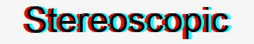
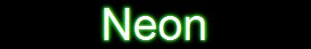
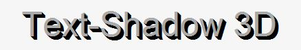
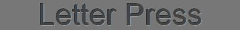
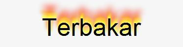

Tutorial ini merupakan bagian dari seri bermain-main dengan CSS3. Membahas berbagai property-property dari CSS3, cara penggunaannya dan contoh kasus.

- [Bermain-main dengan CSS3 Text-shadow](/?p=1256)
- [Bermain-main dengan CSS3 Box-shadow](/?p=1275)

[Text-shadow](/?p=1256), sesuai dengan namanya digunakan untuk memberikan shadow pada teks :). berikut penjelasan property dan valuenya.

text-shadow: offset-X  offsey-Y  Blur-radius  Color ;

Offset-X akan mendorong/menggeser shadow dari text beberapa pixel ke Kiri/Kanan. Offset-Y akan mendorong/menggeser shadow dari text beberapa pixel ke Atas/Bawah. Blur-Radius adalah tingkat blur dari shadow, dan color digunakan untuk mendefinisikan warna dari shadow.

Contoh penggunaan sederhananya

.text{
    text-shadow: 10px 10px 10px red;
}

Untuk menggeser shadow ke Kiri atau ke Atas, gunakan Nilai Negatif, contohnya

.text{
    text-shadow: -10px -10px 10px red;
}

[Text-shadow](/?p=1256) juga bisa memiliki beberapa value atau multiple shadow. jadi anda dapat membuat beberapa shadow sekaligus. Anda tinggal menambahkan koma sebelum nilai selanjutnya.

.text{
    text-shadow: -10px -10px 10px orange , 10px 10px 10px red;
}

Itulah contoh penggunaan normal dari [text-shadow](/?p=1256) :) . saya sebut normal karena selanjutnya kita akan bermain-main dengan property ini untuk membuat efek yang abnormal.. he.he, Yuk kita mulai saja.

[Demonstrasi](http://jsfiddle.net/yans_fied/gPLW3/3/embedded/result/ "Demontrasi")[Demo dengan Source](http://jsfiddle.net/yans_fied/gPLW3/3/ "Source")

## Stereoscopic

Pernah Pake kacamata 3d? yang warna kacanya biru dan merah?, jika kita menonton film 3d tanpa kacamata, gambar akan terlihat seperti gosting, ada warna biru dan merahnya. Efek ini disebut dengan Stereoscopic (saya tidak akan menjelaskan apa itu stereoscopic :)).

.stereoscopic{
    text-shadow: 4px 0 0 cyan,-4px 0 0 red;  
}

## Neon

Efek yang satu ini seperti efek Neon, Teks terlihat bercahaya.

.neon{
    background:#000;
    color:#fff;
    text-shadow:    0 0 1px #2ec728,
            0 0 3px #2ec728,
            0 0 5px #2ec728,
            0 0 7px #2ec728,
            0 0 9px #2ec728;
}

## Blur

Teknik pembuatan efek blur adalah memberikan warna transparan pada text, jadi yang tampil hanyalah shadownya saja.

.blur{
    color:transparent;
    text-shadow:0 0 5px black;
}

## Teks 3 Dimensi

Shadow yang digunakan seakan-akan membuat teks terlihat seperti 3 Dimensi.

.d3{
    color:#aaa;
    text-shadow:    1px 1px 0 black,
            2px 2px 0 black,
            3px 3px 0 black,
            4px 4px 0 black,
            5px 5px 0 black;
}

## Letter Press

Efek ke lima adalah efek Letter Press, Teks seakan-akan menonjol ke dalam seperti di press, tekniknya adalah membuat shadow terang di bawah dan gelap di atasnya.

.letter{
    color:#444;
    background:#777;
    text-shadow: 1px 1px 1px rgba(255,255,255,.3),-1px -1px 0 rgba(0,0,0,.6);
}

## Terbakar

Penggunaan dari text-shadow yang terakhir adalah efek terbakar.

.fire{
    text-shadow:    0 0 4px white, 
            0 -5px 4px #FF3, 
            2px -10px 6px #FD3, 
            -2px -15px 11px #F80, 
            2px -25px 18px #F20;
}

## Kesimpulan

Pada dasarnya, semua efek tersebut memanfaatkan fitur multiple shadow dengan kombinasi warna-warna yang berbeda sehingga memberikan kesan tertentu.

## Sumber

- [w3schools.com](http://w3schools.com)
- [HTML5 Text Effect](http://www.html5rocks.com/en/tutorials/canvas/texteffects/)
