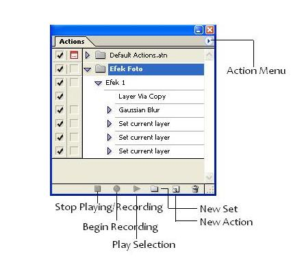
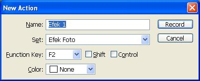
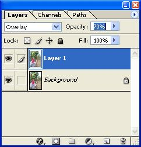
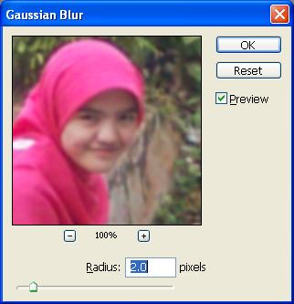
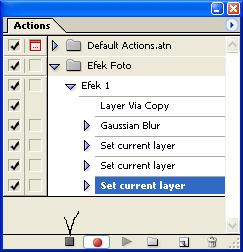
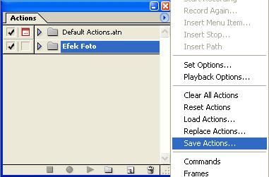

Jika anda serng membuat efek yang sama ketika mendesain sesuatu, tidak ada salahnya anda mencoba trik berikut, [Photoshop Action](/2011/10/photoshop-action-cara-untuk-menghemat-waktu-anda). Selain menghemat waktu andapun tidak perlu repot mengulangi kegiatan yang sama beberapa kali.

[Photoshop Action](/2011/10/photoshop-action-cara-untuk-menghemat-waktu-anda), adalah hasil dari Rekaman (Recording) tahap-tahap pembuatan efek yang kita lakukan, jadi, jika anda ingin menerapkan efek yang sama, anda tinggal menekan tombol Play dan biarkan Photoshop bekerja untuk anda. :)

Pada tutorial hari ini, saya akan berbagi cara menggunakan trik ini. kita akan membuat action untuk efek yang diberikan seperti pada tutorial ["3 Langkah mempercantik foto."](/2010/08/3-langkah-mudah-mempercantik-foto/ "3 Langkah mudah mempercantik foto")

## Langkah pertama : Persiapan

Bukalah sebuah foto sebagai objek pembuatan [Action](/2011/10/photoshop-action-cara-untuk-menghemat-waktu-anda) (Anda pasti sudah tahu bukan, cara membuka foto ke photoshop?? :)).Jika palet Action belum muncul, anda tinggal memanggilnya dengan memilih menu, Windows > Action atau tekan kombinasi tombol Alt+F9.

## Langkah kedua : Membuat Set

Buat Set (Folder) baru untuk Action yang akan kita buat, lalu beri nama "Efek Foto" atau terserah anda.

 Baru untuk action yang akan kita buat")

## Langkah ketiga : Mulai Recording

Selanjutnya kita buat [Action](/2011/10/photoshop-action-cara-untuk-menghemat-waktu-anda) baru, dengan mengklik tombol Create New Action, beri nama "Efek 1", Pilih Set yang telah kita buat sebelumnya,"Efek Foto", lalu tentukan shortcut yang akan anda pakai, misalnya F2, lalu Klik Record untuk mulai Merekam Aksi yang akan kita lakukan.

## Langkah keempat : Mulai membuat Efek

Duplikasi Foto yang kita buka dengan menekan tombol Ctrl+J.

Beri Filter Gaussian Blur, dengan nilai Blur Radius 2.

Set Layer Blending menjadi Overlay dan Ubah Opacity Menjadi 70%

Untuk mengakhiri perekaman Action, Klik tombol "Stop Playing/Recording". Action pun telah kita buat.

## Let's Test it!

Untuk menguji Action yang telah kita buat, buka kembali foto berbeda, lalu pada pilih "Efek 1" yang telah kita buat dan klik Play Selection dan Boom!!

## Share It!

Save Action yang telah kita buat, Klik Set Action kita, yaitu "Efek Foto" lalu, Klik Palet Menu (Pojok Kanan Atas), dan Pilih Save Action. beri nama sesuka anda.

File yang dihasilkan akan memiliki akhiran .atn, misalnya "Efek Foto.atn", untuk membukanya cukup dengan men-drag ke Photoshop, atau Open With ... Photoshop.

## Kesimpulan

Jika anda sering membuat desain/efek yang sama, gunakanlah trik ini, selain untuk menghemat waktu anda, andapun dapat berbagi efek andalan anda dengan yang lainnya. menguntungkan bagi anda juga menguntungkan bagi yang lainnya. :)
