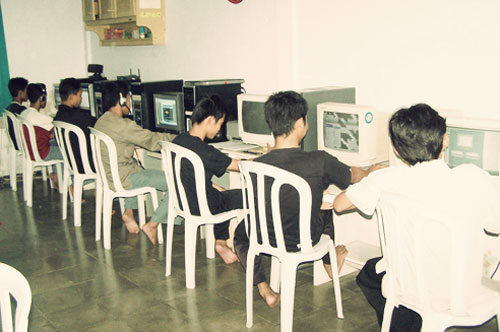

Anda kuliah di bidang IT (Information Technology/Teknologi Informatika) ?. Apakah anda merasa cukup hanya dengan mengikuti kuliah saja untuk menguasai dunia TI?

Saya rasa tidak!. seperti yang Saya rasakan sekarang, kuliah saja tidaklah cukup untuk mengerti, memahami dan menguasai Teknologi Informatika atau apa saja yang ada di dalamnya. Bagaimana tidak, di kampus kita hanya dijajali dengan teori-teori dan ceramah. Belum lagi kalau dosennya tidak kompeten dengan apa yang mereka ajarkan. Terkadang ada dosen yang salah kamar yang pada akhirnya mahasiswa jugalah yang dirugikan.

Lalu bagaimana cara untuk menutupi kekurangan-kekurangan tersebut?, saya akan sedikit sharing tentang cara untuk menutupi kekurangan-kekurangan tersebut.

## Membaca

Yah, mau tidak mau anda harus sering membaca, baik itu membaca buku tentang informatika, tutorial pemrograman, tutorial desain atau buku-buku tutorial yang bersifat fundamental lainnya. Malahan Sekarang anda tidak perlu membeli buku IT yang harganya yang cukup mahal menurut saya. Anda dapat memanfaatkan situs-situs seperti wikipedia atau blog-blog yang menyediakan artikel-artikel IT.

Tak perlu ragu untuk membaca media apapun, koran bungkus Gorenganpun harus anda baca. tak peduli dari mana ilmu tersebut keluar, kita tetap harus mengambilnya :).

## Terus Latihan

Jika anda belajar sejenis bahasa pemrograman, yang harus anda lakukan adalah terus berlatih. baik itu latihan dengan bantuan buku tutorial, atau anda dapat membuat kasus sendiri. Misalnya, jika anda sudah bekerja, tidak ada salahnya anda membuat aplikasi yang mungkin akan memudahkan pekerjaan anda.

Dari latihan kasus tersebut, nantinya anda akan menemukan berbagai kesulitan. nah dari sinilah kemampuan anda akan diuji, carilah solusi dari internet atau tanyakan ke dosen yang bersangkutan langsung, atau diskusikan dengan teman sekelas atau kakak kelas yang memiliki kompetensi.

## Ikuti Forum-forum IT

Di internet, kini tersebar forum-forum programmer atau bidang IT lainnya. Jangan ragu untuk bergabung di forum-forum tersebut. Di forum anda dapat bertanya, berbagi atau saling memberikan solusi antar anggota forum.

Jika anda punya permasalahan tentang proyek atau latihan kasus seperti tadi, anda bisa tanyakan di forum, bantuanpun akan terus berdatangan selama masalah belum ditutup.

## Ikuti Kursus

Selanjutnya, jika anda ingin memperdalam suatu bidang, ada baiknya mengikuti kursus. Kadang materi yang diberikan ditempat kursus lebih spesifik dan lebih mengena. Pembelajaran di tempat kurus bisa jadi lebih efektif daripada kuliah. selain biayanya yang relatif murah dibanding dengan kuliah.

## Kesimpulan

Jika anda hanya mengandalkan materi yang diajarkan di kampus, maka anda akan tertinggal jauh. Begitu juga dengan kompetensi yang anda dapatkan. Dan perlu diingat, Seorang ahli IT yang handal tidak berasal dari Kampus tertentu, bahkan anak jalanan pun bisa menjadi ahli IT asalkan ada kemauan.
