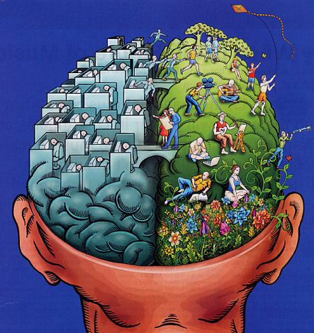

Saya mulai mengenal blogging sejak kelas 3 SMA, pertamakali kenal dengan yang namanya multiply. namun karena internet masih langkah ditempat saya dulu, blog tersebutpun terbengkalai. 2 tahun berlalu, saya pun bersemangat untuk kembali nge-Blog. Seperti biasa mengusung tema Design dan saya beri nama i-Bitv alias Indonesian Bitmap Vector tutorial. Blognya lumayan rame dan sayapun bersemangat untuk terus menulis tutorial sampai Situs ini dibuka.

Sebenarnya apa motivasi saya untuk nge-Blog seperti sekarang ini?, Selain Sharing pengetahuan yang kita miliki, saya memiliki motivasi lain, yaitu dokumentasi Ilmu. yah.. dokumentasi Ilmu.

Otak bukanlah Harddisk yang bisa menyimpan data sampai kapanpun selama tidak terhapus, ilmu yang kita miliki lama-kelamaan akan tergerus oleh bertambahnya umur, apalagi jika ilmu tersebut jarang atau bahkan tidak diamalkan sama sekali. Untuk itu nge-Blog lah salah satu cara untuk mendokumentasikan ilmu yang dimiliki.

Jujur, sekarang saya sudah lupa dengan yang namanya Corel Draw karena sekarang lebih sering menggunakan Adobe Illustrator, tapi jika sewaktu-waktu saya harus menggunakan Corel saya bisa mempelajarinya kembali secara singkat, dimana lagi kalau bukan di Blog saya dulu :). Itulah manfaat ngeblog, selain dokumentasi andapun bisa berbagi pengetahuan anda dengan yang lainnya.

Sebenarnya masih banyak Motivasi untuk anda nge-Blog mulai dari Sharing Ilmu, Promosi Usaha sampai Mencari Penghasilan. Lalu apa motivasi anda ?
