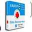

Tak selamanya software gratis atau biasa disebut dengan freeware memiliki kualitas yang buruk atau pas-pasan, nyatanya banyak sekali freeware yang sanggup bersaing dengan software-software jutaan rupiah yang tersebar di pasaran.

Tengok saja Blender atau Google SketchUp, aplikasi rancang bangun 3d yang mampu bersaing dengan software kelas atas seperti 3ds Max, AutoCAD atau maya.

Pada artikel ini, saya merangkum 20 lebih freeware terbaik dan memiliki kualitas yang sangat tinggi, dikelompokkan berdasarkan kategorinya masing-masing. Selamat menikmati :).

## Antivirus

- 
    
    **Avira Antivir Free Edition**Meskipun versi gratis, namun kepekaan dalam mendeteksi keberadaan virusnya tidak kalah peka, Download gratis, perpanjangan key gratis, dan updatepun gratis [Download](http://www.avira.com/en/support-download-avira-free-antivirus)[Mirror](http://filehippo.com/download_antivir/)
    

- 
    
    **AVG Free Edition**Selain Avira, AVG juga merupakan antivirus gratis yang sangat digemari, tingkat deteksinyapun lumayan peka terhadap virus-virus yang masuk ke komputer anda [Download](http://www.freeavg.com/?lng=id-id&cmpid=free)[Mirror](http://filehippo.com/download_avg_antivirus_32/)
    
- 
    
    **Avast**Avast versi free mengharuskan kita me-register terlebih dahulu, tapi gratis kok. kepekaannya juga cukup tinggi dan bisa diandalkan [Download](http://www.avast.com/free-antivirus-download)[Mirror](http://filehippo.com/download_avast_antivirus/)
    

## 3D Modelling

- 
    
    **Google SketchUp**Software 3D modelling yang sangat mudah, praktis bahkan bisa dianggap paling mudah untuk dioperasikan. Anda yang bukan arsitek pun bisa membuat model 3d bangunan dengan mudah. [Download](http://sketchup.google.com/)[Mirror](http://filehippo.com/download_google_sketchup/)
    
- 
    
    **Blender**Software 3D modelling yang satu ini sangat lengkap, bisa digunakan untuk pembuatan film, game, model bangunan dan masih banyak lagi, mampu menyaingi 3DsMax [Download](http://www.blender.org/download/get-blender/)[Mirror](http://filehippo.com/download_blender/)
    
- 
    
    **GMax**Versi free dari 3D Studio Max ini sangat cocok digunakan untuk membuat objek yang akan digunakan dalam sebuah game, penampilannya hampir sama dengan 3DsMax. [Download](http://www.turbosquid.com/gmax)
    

## Audio & Video Player / Editor

- 
    
    **Audacity** Software untuk editing sound, meskipun tidak secanggih Sonar, atau Sound Editor lainnya, Audacity lebih mudah digunakan dengan fitur-fitur standar dalam editing Audio [Download](http://audacity.sourceforge.net/)[Mirror](http://filehippo.com/download_audacity/)
    
- 
    
    **Avidemux** Kalau yang satu ini adalah Software Edit Video, bisa digunakan untuk editing video sederhana dan support berbagaimacam format video, juga tersedia untuk berbagai platform [Download](http://avidemux.sourceforge.net/)
    
- 
    
    **K-Lite Mega Codec Pack** Video Player gratis yang sering digunakan karena kompatibilitasannya terhadap berbagai macam format Video dan Audio, disertai dengan Windows Media Player Classic yang lebih ringan dan cepat. [Download](http://www.free-codecs.com/download/k_lite_codec_pack.htm)[Mirror](http://filehippo.com/download_klite_mega_codec/)
    
- 
    
    **Winamp** Siapa yang tidak tahu Winamp? bagi sebagian orang, winamp wajib terinstall. Audio Player yang sangat digandrungi ini memiliki fitur yang banyak meskipun pada versi gratisnya. [Download](http://www.winamp.com/media-player/all)[Mirror](http://filehippo.com/download_winamp/)
    

## Image Manipulation/Editor

- 
    
    **Gimp** Gimp tersedia di Linux dan Windows, pesaing Photoshop ini memiliki fitur-fitur yang hampir sama dengan Photoshop, Aplikasinyapun mudah untuk dioperasikan. [Download](http://www.gimp.org/downloads/)[Mirror](http://filehippo.com/download_the_gimp/)
    
- 
    
    **Paint.Net** Tersedia Untuk Windows, dan bisa dijadikan pengganti Microsoft Paint, Mudah digunakan seperti halnya Photoshop dan memiliki fitur-fitur yang tidak kalah keren. [Download](http://paint.net/)[Mirror](http://filehippo.com/download_paint.net/)
    
- 
    
    **PhotoScape** Biasa digunakan untuk mengedit foto ringan, namun mampu membuatnya tampak lebih profesional sama dengan hasil jepretan fotograper handal. Simple dan mudah digunakan [Download](http://www.photoscape.org/ps/main/download.php)
    

## Browser

- 
    
    **Google Chrome** Browser besutan Google ini sangat ringan, cepat dan sederhana, namun dilengkapi dengan berbagai Apps dan Ekstensi yang Ciamik yang bisa diinstall di Chrome Webstore [Download](http://www.google.com/chrome)[Mirror](http://filehippo.com/download_google_chrome/)
    
- 
    
    **Firefox** Bisa disebut browser rakyat, karena kepopulerannya di kalangan pengguna internet. Kaya akan Add-On sehingga membuatnya lebih powerfull untuk kegiatan apapun selain browsing. [Download](http://www.mozilla.org/id/firefox/new/)[Mirror](http://filehippo.com/download_firefox/)
    
- 
    
    **Opera** Browser yang lebih terkenal dengan Opera Mini ini juga banyak digunakan versi PC nya, tampilannya yang simple dan memiliki fitur-fitur yang menarik seperti Opera Unite [Download](http://www.opera.com/download/)[Mirror](http://filehippo.com/download_opera/)
    
- 
    
    **Safari** Tidak hanya di Mac, Safari juga bisa dijalankan di Windows. Browser dengan engine terhebat (webkit) dan memiliki kecepatan yang tinggi dalam loading website. [Download](http://www.apple.com/safari/download/)[Mirror](http://filehippo.com/download_safari/)
    

[//pagead2.googlesyndication.com/pagead/js/adsbygoogle.js](//pagead2.googlesyndication.com/pagead/js/adsbygoogle.js)

(adsbygoogle = window.adsbygoogle || \[\]).push({});

## Email Client & Instant Messenger

- 
    
    **Thunderbird** Email Client dari Mozilla (sama dengan firefox) yang tidak kalah dengan Email Client seperti Microsfot Outlook. Bisa juga ditambahkan Add-On seperti halnya firefox [Download](http://www.mozilla.org/en-US/thunderbird/)[Mirror](http://filehippo.com/download_thunderbird/)
    
- 
    
    **Digsby** Multi Instant Messenger, bisa digunakan untuk berbagai platform chatting, seperti Yahoo Messenger, Facebook, dan masih banyak lagi. [Download](http://www.digsby.com/download.php)[Mirror](http://filehippo.com/download_digsby/)
    
- 
    
    **Pidgin** Sama halnya dengan Digsby, Pidgin lebih banyak digunakan oleh pengguna Linux. Namun Anda pengguna Windowspun bisa mencobanya [Download](http://www.pidgin.im/download/)[Mirror](http://filehippo.com/download_pidgin/)
    

## Data Recovery

- 
    
    **Easeus Data Recovery** Pada versi freenya anda hanya dapat merecover file sampai 1Gb, tapi secara keseluruhan kinerjanya sangat baik dalam menemukan file-file yang hilang karena terhapus atau terformat. [Download](http://www.easeus.com/datarecoverywizard/)
    

- 
    
    **Recuva** Sama halnya seperti Easeus, tapi recuva tidak memberikan batasan, temukan file-file yang hilang dengan recuva tanpa batas :). [Download](http://www.piriform.com/recuva/download/standard)[Mirror](http://filehippo.com/download_recuva/)
    

## Cleaning Tools

- 
    
    **CCleaner** Biasa digunakan untuk bersih-bersih harddisk dari file-file sampah agar tidak memenuhi harddisk. Registry yang rusak pun dapat dibersihkan dengan CCleaner [Download](http://www.piriform.com/ccleaner/download/standard)[Mirror](http://filehippo.com/download_ccleaner/)
    

- 
    
    **Revo Uninstaller** Kalau Revo Uninstaller digunakan untuk Uninstall Aplikasi secara tuntas, tanpa satu filepun dan settingan pada registrypun yang ditinggalkan [Download](http://www.revouninstaller.com/revo_uninstaller_free_download.html)
    

## Office

- 
    
    **LibreOffice** Pesaing Microsoft office namun dengan penampilan yang berbeda dan mirip dengan Office 2003. Lengkap dengan Presentation, dan Formula (Excel) Tersedia untuk Windows, Linux dan Mac [Download](http://www.libreoffice.org/download)[Mirror](http://filehippo.com/download_libreoffice/)
    
- 
    
    **Google Docs** Aplikasi yang satu ini berbasis Cloud, jadi untuk memakainya anda harus Online dan menggunkan Browser :) [Download](http://docs.google.com/)
    
- 
    
    **Foxit Reader** Aplikasi untuk membuka file PDF yang sangat ringan dan sederhana. lebih ringan dan cepat dibanding dengan Adobe Reader [Download](http://foxitsoftware.com/downloads/)[Mirror](http://filehippo.com/download_foxit/)
    

## Customizing Tools

- 
    
    **Fences** Digunakan untuk merapihkan icon-icon yang ada di desktop, anda bisa mengkategorikannya sesuai keinginan. [Download](http://www.stardock.com/products/fences/downloads.asp)[Mirror](http://filehippo.com/download_fences/)
    
- 
    
    **RainMeter** Widget untuk menghiasi Desktop anda, flexible dan kaya akan Widget yang keren. Jika terhubung dengan internet anda dapat menggunakan widget seperti RSS Feed atau GMain Checker [Download](http://rainmeter.net/cms/)
    
- 
    
    **RainLendar** Kalo yang ini aplikasi widget Kalendar, anda dapat membuat event-event tertentu atau membuat reminder pada tanggal tertentu [Download](http://www.rainlendar.net/cms/index.php?option=com_rny_download&Itemid=32)[Mirror](http://filehippo.com/download_rainlendar/)
    

Anda punya kategori yang berbeda atau aplikasi freeware favorit anda tidak disebutkan, beritahu saya via Komentar di bawah, biar saya Listing dan Rekomentasikan di Artikel selanjutnya :)
