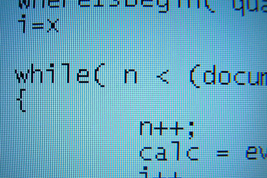
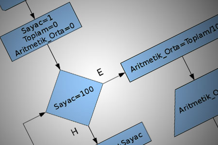
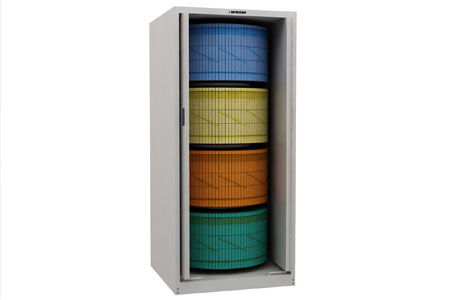

Mempelajari pemrograman komputer bisa dibilang susah-susah gampang, tapi jika anda perhatikan ada beberapa konsep dan istilah yang perlu anda pahami terlebih dahulu sebelum memulai belajar pemrograman komputer.

Konsep dan istilah ini berlaku untuk seluruh Bahasa pemrograman yang akan anda pelajari, baik itu Pascal, Delphi, Visual Basic, C++ atau sebagainya. kabar baiknya, yang akan saya bagikan sekarang akan sangat membantu anda untuk mempelajari Bahasa pemrograman.

## Algoritma

_Jika anda mau jadi programmer yang handal anda harus memiliki algoritma yang baik_ begitu kata para programmer. _Lalu apa arti algoritma itu sendiri?_ Sebagai contoh perhatikan cerita berikut. _"Saya membeli sebuah Handphone tercanggih, tentunya saya tidak dapat mengoperasikannya sama sekali saking canggihnya. tapi karena di dalam paketnya terdapat buku panduan manual, maka sayapun dapat menggunakan handphone tersebut."_ Buku Manual bisa saya sebut dengan buku algoritma, di dalamnya terdapat langkah-langkah mulai dari cara menghidupkan handphone, memasang kartu, menyimpan data, cara menelfon dan banyak lagi.

Langkah-langkah tersebut disusun sedemikian rupa sehingga yang tidak tahu cara kerja handphone tersebutpun jadi tahu hanya dengan membaca langkah-langkah tersebut.

Komputer bukanlah alat yang hebat, komputer sendiri tidak tahu apa yang sedang ia lakukan. Namun karena para programmer telah memberikan panduan-panduan sebelumnya (Dalam bentuk Algoritma pemrograman) maka komputerpun menjadi alat yang berguna.

Algoritma sama halnya dengan panduan-panduan untuk melakukan sesuatu, anda belajar algoritma berarti anda belajar membuat panduan untuk komputer (hebat bukan?). camkan bahwa komputer itu tak ubahnya seperti bayi yang baru lahir, kita harus mengajarinya mulai dari nol.

## Tipe Data

Dalam Matematika ada bermacam-macam bilangan, misalnya Bilangan Bulat, Bilangan Desimal dan sebagainya. Dalam bahasa pemrograman Bilangan bulat disebut dengan Integer dan Bilangan Desimal disebut dengan Real atau Double. lalu bagaimana dengan Huruf? Kumpulan beberapa huruf dan angka disebut dengan String. sebagai contoh.

10,20,3,5,100,125,175  disebut dengan Integer.
12.5, 14.75, 1.2, 1.0  disebut dengan real atau Double
"ada 3 Apel di box"    disebut String, biasanya diapit dengan tanda kutip.

## Variable

Jika anda ingat pelajaran Matematika dulu, maka variable sering ditemukan disana, Variable biasa disebut dengan peubah. Tapi samakah arti variable di matematika dan bahasa pemrograman?. Jawabannya sama, variabel di dalam bahasa pemrograman tak ada bedanya dengan yang ada di matematika. Variabel digunakan untuk menyimpan data sementara, dan dapat berubah-ubah sewaktu-waktu sesuai dengan kebutuhan.

Jika anda tidak mengerti sama sekali variabel, saya sederhanakan dengan sebuah perumpamaan. bayangkan variabel itu adalah sebuah box kardus. Anda dapat memasukkan barang apapun kedalam kardus tersebut. :).

Contoh matematisnya adalah seperti berikut:

x= 10
y = 20
x+y=30

x dan y disebut dengan variabel, untuk variabel X kita masukkan angka 10 dan untuk Y kita masukkan angka 20. jadi jika kita baca baris selanjutnya, X+Y=30 maka yang dimaksud dengan X dan Y disini adalah 10+20 Penamaan Variabel tidak harus x dan y, anda dapat memberi nama variabel sesuka anda asalkan tidak memusingkan anda jika anda membutuhkannya kembali untuk suatu operasi.

[//pagead2.googlesyndication.com/pagead/js/adsbygoogle.js](//pagead2.googlesyndication.com/pagead/js/adsbygoogle.js)

(adsbygoogle = window.adsbygoogle || \[\]).push({});

## Array

Di dalam bahasa pemrograman ada yang dinamakan dengan Array, Array sama halnya dengan Variable, digunakan untuk menyimpan data. Namun berbeda dengan variable, jika variabel hanya mampu menyimpan satu tipe data, maka array dapat menyimpan berbagai macam data/tipe data sekaligus.

Dulu saya sering mengumpamakan array dengan sebuah lemari yang memiliki beberapa tingkatan di dalamnya. misalnya kita memasukkan Kemeja dan Kaos ditingkat 1, Celana di tingkat 2, buku di tingkat 3, dan berbagai macam peralatan di tingkat 4. Maka jika kita ubah dengan pendekatan bahasa pemrograman, informasi tersebut menjadi seperti berikut.

Lemari\[1\] = Baju
Lemari\[2\] = Celana
Lemari\[3\] = Buku
Lemari\[4\] = Perkakas

Maksud dari Lemari\[1\] adalah "lemari di tingkat 1", dan 1 disini disebut dengan Index.

### Percabangan

_"Jika Andi belajar maka Andi akan Pintar, Jika tidak maka Andi akan bodoh"._ Ya, kalimat tersebut merupakan contoh percabangan sederhana. di dalam bahasa pemrograman, anda tidak perlu pusing dengan percabangan, anda tinggal mengkonversinya ke dalam bahasa inggris :). misalnya.

If Andi Study then
    Andi will be smart
else
    Andi will be stupid

Percabangan If-then-Else ini akan sering anda temukan dalam bahasa pemrograman apapun. Contoh pendekatan bahasa pemrogramannya :

X = 10
If x > 5 then
    x lebih besar dari 5
else
    x lebih kecil dari 5

Sebelumnya kita memasukkan angka 10 ke variabel x, lalu dengan menggunakan percabangan sebagai pengujian kita tentukan apakah x itu lebih dari 5 atau kurang dari 5. jika kita konversi ke bahasa indonesia maka menjadi seperti berikut :

x = 10
jika X lebih besar dari 5 maka x lebih besar dari 5 jika tidak maka x 

lebih kecil dari 5.

## Looping/Perulangan

_"Saya melakukan kesalahan disekolah, dan saya dihukum untuk menulis **Saya Bersalah** di papan tulis sebanyak 250 kali."_ itulah Contoh perulangan. saya akan terus menulis "Saya Bersalah" di papan tulis sebanyak 250 kali, selama belum mencapai 250 saya akan terus mengulang aktifitas menulis tersebut.

Dengan komputer anda bisa melakukan aktifitas tersebut dengan mudah, sayangnya saya disuruh menulis di papan tulis, kalau saja di komputer akan sangat mudah dilakukan :).

Biasanya struktur perlungan dalam bahasa pemrograman seperti berikut.

X=0
Do
    Tulis "Saya Bersalah"
    X + 1
Until X=250

Bingung? saya jelaskan, pertama-tama agar saya tidak lupa jumlah yang telah saya tulis, maka saya tulis terlebih dahulu di kertas bahwa saya belum menulis sama sekali (x=0), Setiap setelah menulis "Saya bersalah", saya juga menuliskan di dalam kertas (Mirip dengan penghitungan suara :) ) Begitu seterusnya sampai saya selesai menulis "Saya Bersalah" sebanyak 250 kali.

jadi aktifitas yang diulang disini adalah Menulis "Saya Bersalah" dan mencatat jumlah yang telah ditulis.

## Kesimpulan

Jika anda sudah mengerti konsep dan istilah tersebut, yang perlu anda pelajari ketika mempelajari bahasa pemrograman tertentu, adalah Bagaimana cara penulisannya dengan benar. Bagaimana penulisan Percabangan (If-then-else) yang benar, bagaimana cara membuat looping, cara pendeklarasian tipe data, dan cara membuat dan menggunakan variable dan array.
