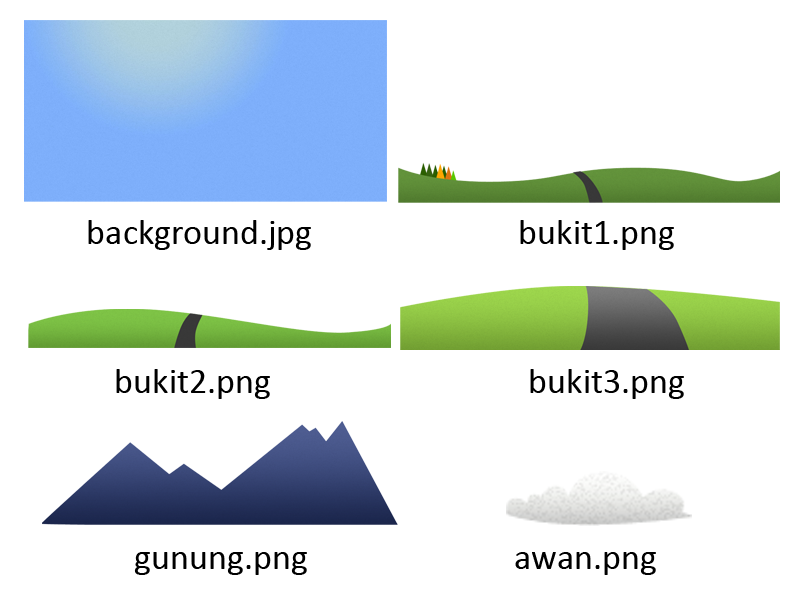

Parallax adalah efek yang biasa kita lihat ketika sedang menaiki kendaraan, objek yang berjarak dekat akan terlihat bergerak lebih cepat dibandingkan objek dengan jarak yang jauh. Parallax akan memberikan kesan 3 Dimensi jika diterapkan pada objek 2 Dimensi.

Misalnya pada kasus berikut, kita akan merubah objek 2D menjadi tampak seperti objek 3D karena seakan-akan objek-objek tersebut mempunyai jarak dan pergerakan yang berbeda. Agar anda mendapatkan bayangan tentang apa yang akan kita buat perhatikan demonstrasi di link berikut :

[Demonstrasi](http://demo.ariona.net/parallax/index.html) [Download](http://demo.ariona.net/parallax/parallax.zip)

Pada Contoh parallax yang akan kita buat, kita akan menggunakan plugin plax.js yang dibagun oleh "Cameron McEfee". Download terlebih dahulu file plax.js dari situs resminya [http://www.cameronmcefee.com/plax](http://www.cameronmcefee.com/plax) atau Download Demonstrasi di atas.

## Persiapan gambar efek parallax


Perhatikan gambar diatas, saya telah memecahkan kedalam beberapa bagian, pemecahan ini berdasarkan dari jarak sesungguhnya di dunia nyata. misalnya saya pisahkan objek gambar gunung, bukit dan awan.



Pembagian gambar untuk efek parallax

## HTML

Selanjutnya kita panggil gambar-gambar tersebut, tidak lupa kita tambahkan sebuah div dengan nama frame untuk menampung semua objek tersebut.

```
<div id="frame">
    
    
    
    
    
    
</div>
```

Yang perlu ditambahkan pada tag img adalah, atribut data-xrange dan data-yrange, nilai dari atribut ini akan digunakan oleh plugin plax untuk menentukan kecepatan dari objek tersebut ketika mouse digerakkan.  
data-xrange akan menetukan kecepatan objek secara horizontal dan data-yrange secara Vertical ketika mouse digeser-geser. Jadi kode HTML akhir menjadi berikut :

```
<div id="frame">
    
    
    
    
    
    
</div>
```

Untuk objek yang berjarak jauh, kita beri nilai kecil, agar pergerakannya menjadi lambat. mengacu pada dunia nyata bahwa objek yang jauh akan terlihat bergerak perlahan dibanding objek yang dekat.

## CSS

Pertama-tama kita siapkan style untuk frame :

```
#frame{
    width:800px;
    height:400px;
    overflow:hidden;
    margin:10px auto;
    position:relative;
}
```

Selanjutnya, kita ubah position dari seluruh tag img menjadi absolute :

```
#frame img{
    position:absolute;
}  
```

Terakhir, kita tinggal mengatur posisi dari objek-objek yang ada dengan properti top dan left, sehingga objek-objek yang ada tersusun sesuai gambar utuh sebelumnya.

```
#gunung{
    top:20px;
    left:-100px;
}
#bukit1{
    top:250px;
    left:-50px;
}
#bukit2{
    top:280px;
    left:-50px;
}
#bukit3{
    top:340px;
    left:-100px;
}
#awan{
    top:30px;
    left:40px;
}
```

## Efek Parallax dengan Javascript

```
<script src="jquery.js"></script>
<script src="plax.js"></script>
```

Sentuhan terakhir adalah pada jquery dan plax. Load library javascript dan plax dalam tag head.

lalu tambahkan Script berikut :

```
$(document).ready(function () {
    $('#frame img').plaxify()
    $.plax.enable()
})
```

Save seluruh pekerjaan anda, dan tampilkan dalam browser, cobalah untuk menggeser-geser mouse anda dan perhatikan efek yang anda dapat.  
Andapun dapat bereksperimen dengan foto anda, mengubah foto 2D menjadi semi 3D dengan efek parallax ini, seperti yang anda lihat pada demonstrasi ke 2.

[Demonstrasi](http://demo.ariona.net/parallax/index.html) [Download](http://demo.ariona.net/parallax/parallax.zip)

## Kesimpulan

Dari plugin jQuery parallax yang ada, plax.js lah yang saya rasa sangat mudah digunakan. kita tinggal menambahkan atribut tambahan (HTML5) pada tag yang ingin kita tambahkan efek parallax atau anda juga dapat menambahkannya melalui script js (untuk keterangan lebih lanjut, perhatikan dokumentasi plax.js).

Jika anda ingin belajar tentang HTML dan CSS dari awal, silahkan download ebook saya tentang HTML dan CSS gratis di sini [/ebook-belajar-html-dan-css/](/ebook-belajar-html-dan-css/)
