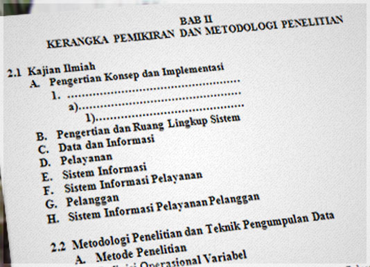

Semantik? apa sebenarnya arti semantik, khususnya semantik dalam HTML. Mungkin saya akan menjelaskan secara singkat apa yang dimaksud dengan semantik dalam HTML.

## Sekilas tentang HTML

HTML digunakan sebagai bahasa Markup atau bisa juga kita sebut dengan Bahasa Formating dan tugas HTML memang hanya sebatas pada Formating suatu dokumen bukan menentukan bagaimana suatu dokumen tersebut ditampilkan.

Tag-tag HTML dibuat/disediakan sesuai dengan fungsi tertentu dalam formatting dokumen. Perhatikan salah satu tag HTML berikut:

Dalam HTML terdapat tag `<h1></h1>` sampai `<h6></h6>`, tag ini disediakan untuk memformat suatu teks menjadi Judul dokumen atau judul dari suatu paragraf (Heading). Sebagai contoh dalam kehidupan kita sehari-hari adalah pada penulisan Judul-Judul di dalam Buku.

Dalam sebuah buku, pasti ada format penjudulan. Ada Judul Utama (**Bab 1** - misalnya), ada subjudul (**1.1 Subjudul**), ada sub dari subjudul (**1.1.1 sub-subjudul**), Penjudulan ini bisa dilakukan dengan menggunakan tag H1 s.d H6 dan memang untuk itulah tag tersebut digunakan.

Jangan menggunakan tag h2 karena ukurannya lebih kecil dari h1, atau menggunakan tag h4 karena ukurannya lebih kecil dari h2/h3. Gunakanlah tag tersebut karena memang judul tersebut adalah levelnya (sesuai hierarki dokumen).

## Contoh lain

_Apa perbedaan antara tag `<em>` dan `<i>` atau tag `<strong>` dengan `<b>`?_ Jika keduanya ditampilkan dalam browser maka tag-tag tersebut memiliki tampilan (representasi) yang sama, `<em>` & `<i>` ditampilkan miring, `<strong>` & `<b>` ditampilkan tebal.

Sekali lagi, saya tekankan. Jangan menggunakan tag HTML karena tag tersebut ditampilkan seperti apa, melainkan gunakan tag HTML sesuai dengan tujuan dari tag tersebut. Untuk memahami perbedaan antara tag-tag tersebut perhatikan contoh berikut :

Anda sedang menjawab pertanyaan-pertanyaan seputar CSS, salah satu pertanyaanya seperti berikut :

Dibawah ini adalah property CSS3, _kecuali_:

- box-shadow
- text-shadow
- border-radius
- border-top

Dari soal tersebut, perhatikan kata "kecuali". kata tersebut dimiringkan karena memiliki tekanan atau maksud tertentu, betul tidak?. Lalu tag apa yang harus digunakan untuk memiringkan kata kecuali tersebut? tag `<em>` kah? atau `<i>`?

Jawabannya adalah tag `<em>` karena memang tag ini ditujukan untuk menekankan suatu kata (emphasise) dan secara default dalam setiap browser akan ditampilkan miring.

Berbeda ketika kita **hanya ingin** menampilkan (merepresentasikan) suatu teks menjadi miring, maka kita gunakan `tag <i>` karena tidak ada penekanan sama sekali pada teks yang kita maksud, kita hanya ingin memiringkan teks tersebut! tidak ada niat lainnya.

## Kesimpulan

### Lalu apa maksud semantik dalam HTML?

Jadi, yang dimaksud dengan sematik dalam bahasa kita adalah "arti/makna yang terkandung dalam suatu kata". Jadi, dalam HTML bisa dikatakan seperti berikut gunakanlah tag-tag HTML sesuai dengan "arti"/tujuan/fungsi dari tag tersebut. berkaitan dengan contoh sebelumnya, penggunaan tag `<em>` **lebih semantik** jika diterapkan pada kata/teks yang membutuhkan suatu penekanan khusus daripada menggunakan tag `<i>` yang hanya berfungsi menampilkan teks menjadi miring saja.

Pada HTML5 telah ditambahkan beberapa tag HTML baru yang diantaranya lebih menekankan pada semantik, seperti article, figure,figure caption,video,audio dan lain sebagainya.

Pembahasan di atas hanyalah opini dari pemahaman saya akan apa itu semantik dalam HTML, jika anda merasa tidak setuju jangan sungkan untuk memprotes dengan berkomentar. Anda yang ingin menambahkan atau bertanya pun silahkan. :)

## Sumber

- [Google Code University : HTML, CSS and Javascript Ground up Video Tutorial](http://code.google.com/intl/id/edu/submissions/html-css-javascript/ "Google Code University")
- [HTML5 Doctor : Lets talk about semantics](http://html5doctor.com/lets-talk-about-semantics/ "HTML5 Doctor : Lets talk about semantics")
