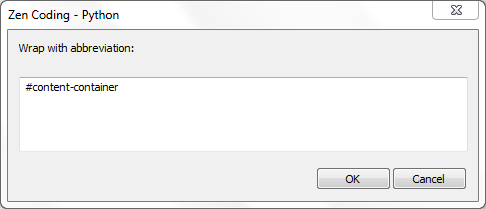
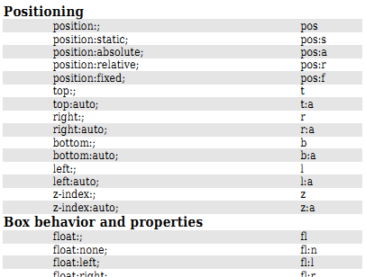

Artikel ini adalah Update dari artikel yang sama sebelumnya ([Zen Coding : Cara cepat menulis kode HTML & CSS](/zen-coding-cara-cepat-menulis-kode-html-css/ "Zen Coding : Cara cepat menulis kode HTML & CSS")), Pada artikel ini kita akan mempelajari teknik-teknik lain dari penggunaan Zen Coding dan Fitur terbaru Zen Coding untuk mempercepat pembuatan markup Anda.

## Unlimited Nesting

Pada tutorial sebelumnya tidak dibahas bagaimana jika setelah kita membuat Child lalu ingin membuat sibling untuk parent yang lain. Anda tidak bisa menggunakan Script seperti berikut untuk melakukannya :

#parent<.child>#parent-sibling>.child

yang dimaksudkan membuat markup seperti berikut :

```html

```

Untuk menyelesaikan masalah tersebut, Anda harus menggroupkan bagian yang memiliki child dengan tanda kurung, seperti berikut:

(#parent>.child)+(#parent-sibling>.child)

Dengan begitu, markup di atas akan anda dapatkan ketika menekan tab (expand abbreviation). Dengan teknik ini bukan tidak mungkin untuk menulis **seluruh Markup HTML hanya dalam 1 Baris!!**, coba ketikkan/copy paste kode berikut, lalu tekan tab.

html:5>(header#header>(h1#logo>a\[href="http://www.ariona.net"\])+(nav#menu>ul>li\*3>a))+(#content>(#main-content>.post\*5>img.post-thumbnail+h1+p)+(aside#sidebar>ul.widget-area>li.widget\*3))+(footer#footer>a)

## Pengisian Content

Pada versi terbarunya, kita dapat mengisi Konten dari suatu tag, Anda tinggal memasukkan konten tersebut di dalam kurung kurawal {} seperti berikut:

a.button{Download}

Dan anda akan mendapatkan sebuah link lengkap dengan kontennya :

<a href="" class="button">download</a>

## Wrap with Abbreviation

Jika anda ingin menambahkan sebuah elemen sebagai parent dari suatu div, seperti kasus berikut : Terdapat sebuah div

Saya Konten

kemudian anda ingin menambahkan parent pada div tersebut menjadi seperti kode berikut :

    

Saya Konten

</div>

Yang harus anda lakukan, adalah memblok div tersebut, lalu tekan shortcut CTRL+ALT+ENTER([Sublime Text](/12-text-editor-pilihan/ "12 Text Editor pilihan")) atau Ctrl+ALT+SHIFT+ENTER ([Notepad++](/12-text-editor-pilihan/ "12 Text Editor pilihan")) atau cari menu "Wrap with Abbreviation" dimenu zen coding, Sebuah dialog akan muncul dan ketikkan kode yang ingin anda tambahkan.



Teknik ini bisa digunakan untuk merubah sebuah list mentah menjadi list dengan tag ul/ol. Misalnya kita punya list mentah seperti berikut

item ke 1
item ke 2
item ke 3

Seleksi/block list mentah tersebut, lalu tekan shortcut di atas, dan ketikkan kode berikut :

ul>li\*

Kini list mentah anda menjadi list "beneran" :).

```html

<ul>
    <li>item ke 1</li>
    <li>item ke 2</li>
    <li>item ke 3</li>
</ul>
```

## Zen Coding Untuk CSS

Banyak yang bertanya seperti ini ["Ini kan contoh untuk HTML, nah untuk CSS bagaimana?"](/zen-coding-cara-cepat-menulis-kode-html-css/#comment-615466721 "Question?"), Padahal saya sudah menyarankan untuk mendownload Cheatsheetnya, Anda dapat mendownload Cheatsheet ZenCoding disini.

[Download Cheatsheet](http://code.google.com/p/zen-coding/downloads/detail?name=ZenCodingCheatSheet.pdf&can=2&q=)

dan perhatikan bagian CSS (Halaman Ke-4), bagian property adalah property CSS yang ingin anda ketik, dan bagian kiri (Alias) adalah kode ZenCoding untuk property tersebut.



Memang anda tidak akan bisa menggunaan Zen Coding untuk CSS seperti pada HTML, karena keduanya adalah bahasa yang berbeda. namun anda masih bisa menggunakan konsep sibling untuk CSS, seperti kode berikut :

m:0+d:ib+ff:ss

Anda akan mendapatkan property-property berikut :

```html

margin: 0;
display: inline-block;
font-family: sans-serif;
```

## Sumber

[http://code.google.com/p/zen-coding/](http://code.google.com/p/zen-coding/)
