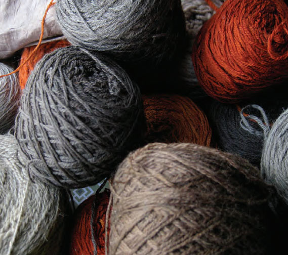
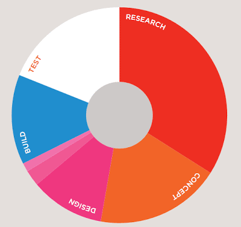
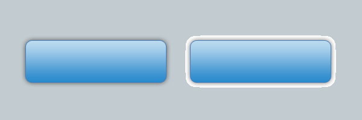
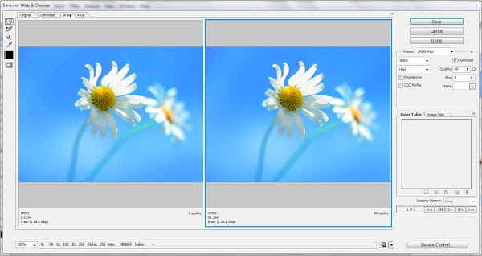
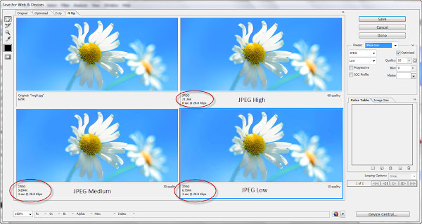
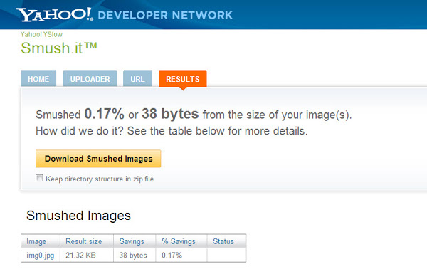

Gambar merupakan pendukung untuk setiap elemen web, mulai dari ilustrasi artikel, gambar pendukung artikel bahkan gambar-gambar yang digunakan dalam desain webnya.

Ada berbagai macam tipe file gambar, seperti jpg, png, dan gif. semuanya memiliki karakteristik dan kualitas yang berbeda, lalu tipe file apa yang cocok digunakan untuk web? disini saya mencoba berbagi tips optimasi gambar untuk web, memilih tipe file yang tepat dan optimasi gambar agar ukurannya lebih kecil namun masih memiliki kualitas yang baik.

## Memilih tipe file yang tepat

Seperti yang telah saya sebutkan ada berbagai macam tipe file gambar, diantaranya jpg, png dan gif. Berikut ini saya jelaskan kapan suatu tipe file harus digunakan :

### JPEG

Ketika gambar yang ingin anda gunakan dalam web, misalnya dalam artikel atau bahkan elemen pendukung desain web memiliki bermacam-macam warna atau kompleksitas warna yang tinggi contoh sederhananya adalah gambar hasil "jepretan foto" gunakan tipe file JPEG.

Penggunaan tipe file JPEG pada gambar-gambar tersebut sangat mendukung karena file JPEG mampu meyimpan beragam informasi warna/menjaga kualitas gambar meskipun ukuran filenya kecil.

### GIF

Ketika gambar memiliki warna sedikit, atau sebagian area didominasi oleh satu warna, maka tipe gambar gif lah yang cocok untuk digunakan. Contoh gambar yang bisa memiliki tipe gif ini adalah logo (logo sederhana), diagram dan lain-lain.

### PNG

Tipe file PNG bisa digunakan ketika gambar yang akan anda gunakan memiliki transparansi. Meskipun tipe file GIF bisa memiliki transparansi namun tipe file PNG lebih cocok untuk masalah ini. tipe gif hanya bisa mentransparankan 100%, ketika ada gradasi warna yang memiliki transparansi, tipe file GIF akan memiliki kualitas yang rendah. berbeda dengan tipe PNG.

Contoh diatas adalah contoh transparansi pada shadow. bagian kiri adalah file PNG dan bagian kanan adalah file GIF (dengan transparansi). Transparansi PNG lebih halus (nilai transparans bisa berkisar antara 0 s.d 100%) sedangkan GIF memiliki area transparan 100% (tidak bisa memiliki transparansi misalnya 50%).

## Optimasi Tipe File

Dengan menggunakan image editor seperti Photoshop, setiap tipe file gambar, masih bisa dioptimasi agar gambar memiliki ukuran rendah dan ramah akan bandwidth internet namun masih memiliki kualitas yang tinggi.

### Optimasi menggunakan Photoshop

Dalam photoshop, setiap Anda ingin menyimpan gambar untuk kebutuhan web, pastikan pilih menu File>Save For Web and Devices.

Atur preset yang disediakan, misalnya ketika Anda ingin menyimpan gambar dengan tipe file JPEG, atur presetnya seperti berikut :

atau anda juga bisa mengatur "Quality"-nya sendiri, perhatikan juga ukuran yang dihasilkan dan kualitas gambarnya.

Untuk mendapatkan transparansi dalam file PNG, pastikan anda memiliki preset PNG-24, jika tidak maka gambar akan memiliki background putih.

### Optimasi menggunakan Situs pihak ketiga

Ada beberapa situs yang melayani untuk optimasi gambar-gambar yang akan digunakan dalam web. misalnya [smush.it](http://www.smush.it) dari yahoo. Kadang gambar yang telah anda optimasi melalui langkah sebelumnya masih bisa dioptimasi kembali oleh smush.it, sehingga file yang dihasilkan lebih kecil namun masih menjaga kualitasnya.

Pada contoh berikut, saya melakukan optimasi untuk file JPEG, dan hasilnya masih bisa dioptimasi sebesar 0.17% dan ukuran gambar berkurang sebesar 38bytes.

### Optimasi Gambar melalui HTML

Optimasi melalui HTML berbeda dengan optimasi sebelumnya. Dalam HTML anda bisa membantu mengoptimalkan kecepatan loading gambar, dengan menentukan atribut width dan height pada gambar. Jika anda tidak menentukan kedua atribut tersebut maka ukuran gambar akan dikalkulasikan terlebih dahulu oleh browser/CPU sebelum ditampilkan dan ini cukup memakan waktu ketika gambar memiliki ukuran super :).

Jadi pastikan anda menentukan atribut width dan height ini sesuai dengan ukuran gambar.

## Jangan meresize melalui atribut width dan height

Jangan sekali-kali meresize/merubah ukuran gambar dengan menentukan atribut width dan height, cara ini akan memperlambat proses loading web. Misalnya anda memiliki gambar dengan ukuran 600px_800px namun anda hanya membutuhkan gambar dengan ukuran 200px_300px dan anda melakukan resizing dengan atribut width dan height :

Solusinya adalah, buat file berbeda untuk ukuran yang berbeda, jangan merubah ukuran gambar dengan menggunakan atribut html. Jangan Pernah! :)

## Kesimpulan

Penggunaan tipe gambar yang tepat dan cara pemuatan gambar yang tepat (dengan menyertakan atribut width dan height) dapat mempercepat loading web, selain itu gambar yang telah dioptimasi akan memiliki ukuran yang relatif kecil namun memiliki kualitas tinggi. Jika demikian, bukan Anda saja yang senang, pengunjung pun ikut senang karena loading webnya yang cepat :).

Referensi : ["HTML and CSS: Design and Build Websites" oleh Jon Duckett](http://as.wiley.com/WileyCDA/WileyTitle/productCd-1118008189.html)
