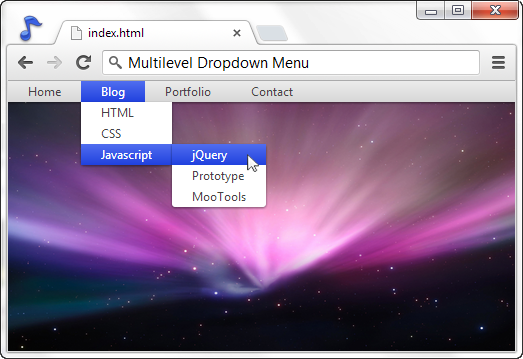
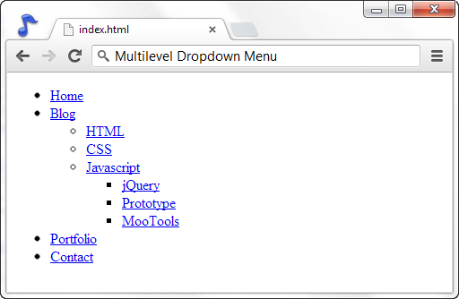
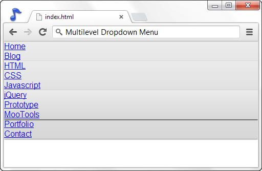
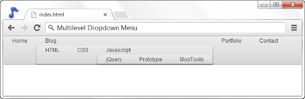
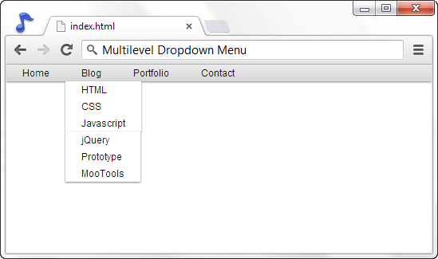
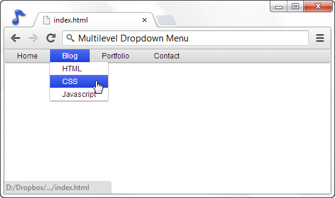
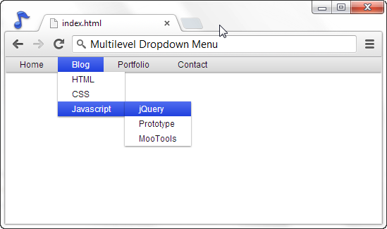

Membuat dropdown menu dengan CSS bisa dibilang gampang-gampang susah, tapi kalau sudah tahu bagaimana cara pembuatannya anda pasti berkata _"Eh ternyata mudah juga yah"_. _So_, pada tutorial kali ini saya akan menjelaskan bagaimana cara pembuatan dropdown menu dengan menggunakan CSS mulai dari proses pembuatan markup HTML sampai pemberian Style.

Jika anda belum tahu apa itu dropdown menu, perhatikan screenshot berikut atau perhatikan menu yang terdapat dalam situs ini

[Demonstrasi](https://dl.dropbox.com/u/26808427/cdn/ariona/demo/dropdown/index.html) [Download](https://dl.dropbox.com/u/26808427/cdn/ariona/demo/dropdown/dropdown%20menu-ariona.net.zip)

## Markup HTML

Pertama-tama kita buat markup HTML untuk dropdown menu kita

<nav>
    <ul>
        <li><a href="#">Home</a></li>
        <li><a href="#">Blog</a>
            <ul>
                <li><a href="#">HTML</a></li>
                <li><a href="#">CSS</a></li>
                <li><a href="#">Javascript</a>
                    <ul>
                        <li><a href="#">HTML</a></li>
                        <li><a href="#">CSS</a></li>
                        <li><a href="#">Javascript</a></li>
                    </ul>
                </li>
            </ul>
        </li>
        <li><a href="#">Portfolio</a></li>
        <li><a href="#">Contact</a></li>
    </ul>
</nav>

Markup di atas adalah markup yang sesuai dengan aturan semantik. Kita menggunakan tag nav untuk mendefinisikan bahwa markup di dalamnya adalah link-link navigasi. Jika anda mau, anda dapat menambahkan id atau class pada nav tersebut sebagai referensi kita untuk CSS ato javascript.

## Pemberian CSS

Pertama-tama kita beri style untuk ul seperti berikut :

\*{ 
    margin:0;
    padding:0;
    font-family:sans-serif;
} /\* simple CSS Reset \*/

nav ul {
    list-style:none;
    background-image:-webkit-linear-gradient(top,#EBEBEB,#D7D7D7);
    background-color:#EBEBEB;
    box-shadow:0 1px 3px rgba(0,0,0,.5);
}
nav ul:after{
    content:" ";
    display:block;
    clear:both;
}

Dalam kode tersebut, kita hilangkan symbol lingkaran yang akan muncul pada ul, lalu pada bagian `ul:after` ini adalah [solusi untuk permasalahan floating](http://ariona.net/5-permasalahan-yang-membingungkan-bagi-css-newbie/) (meng-clearkan area yang memiliki floating). Kenapa bukan solusi `overflow:hidden`? karena kita akan memiliki submenu yang tentunya keluar dari layout menu utama dan jika kita menggunakan solusi `overflow:hidden`, maka submenunya akan tersembunyi.

Sedikit sentuhan dengan memberikan background gradient ([baca artikel bermain-main dengan CSS3 gradient](http://ariona.net/bermain-main-dengan-css3-gradient)) dan box-shadow ([baca juga artikel bermain-main dengan CSS3 box-shadow](/bermain-main-dengan-css3-box-shadow))

nav ul li{
    float:left;
    position:relative;
}

nav ul li a{
    color:#111;
    display:block;
    font-size:12px;
    padding:3px 20px;
    text-decoration:none;
}

[//pagead2.googlesyndication.com/pagead/js/adsbygoogle.js](//pagead2.googlesyndication.com/pagead/js/adsbygoogle.js)

(adsbygoogle = window.adsbygoogle || \[\]).push({});

Selanjutnya kita beri floating left (agar menu berjejer kesamping) pada li dan memberikan position relative karena dalam li ini akan ada element yang memiliki position absolute yakni ul untuk submenu. Kita juga berikan style untuk linknya dengan menghilangkan garis bawah dan memberikan padding agar menu tidak terlalu berdempetan.

nav ul ul{
    position:absolute;
    top:100%;
    background:white;
}
nav ul ul li{
    float:none;
}

Selector tersebut akan memilih ul yang terdapat dalam menu utama atau ul untuk submenu. Seperti saya sebutkan sebelumnya, kita tambahkan position absolute, agar posisi submenu bisa kita atur dengan mudah. penambahan top:100% berfungsi untuk menempatkan sub menu tepat dibawah menu utama (100% tinggi dari menu utama).

Kita juga mereset floating untuk li karena akan memiliki floating yang diturunkan dari style sebelumnya (Agar submenu ditampilkan kembali menurun ke bawah).

Karena submenu seharusnya tersembunyi dan hanya muncul ketika kita meng-hover pada menu yang memiliki sub, maka kita sembunyikan terlebih dahulu ul untuk sub menu ini. Tambahkan `display:none` pada selector `nav ul ul` :

nav ul ul{
    position:absolute;
    top:100%;
    display:none; /\* sembunyikan sub menu \*/
}

Untuk menampilkan sub menu ketika li/menu yang bersangkutan di hover, maka kita gunakan selector seperti berikut :

nav ul li:hover > ul{
    display:block;
}

Sejauh ini dropdown menu kita sudah hampir selesai, coba anda buka dalam browser lalu hover menu blog. Sub menu untuk menu blogpun akan muncul. Kita tambahkan sedikit polesan warna ketika link menu di hover, tambahkan style berikut :

nav ul li:hover > a, nav ul ul li:hover > a  {
    color :white;
    background-image:-webkit-linear-gradient(top, #506def,#2041DE);
    background-color:#506def;
}

Jika style yang diberikan sampai sini, maka menu kita hanya terbatas pada satu submenu (submenu selanjutnya akan ditampilkan dibawah, bukan disamping submenu), agar menu yang kita buat bisa memiliki sub-sub menu lagi di dalamnya (dan ditampilkan di sebelah submen), tambahkan style berikut :

nav ul ul ul{
    position:absolute;
    left:100%;
    top:0;
}   

## IE8

Ok, kebetulan saya ada Internet Explorer 8 (bukan kebetulan kali, emang udah ada dari dulu), saya coba test dengan browser jadul ini dan apa yang terjadi adalah, semua hasil styling kita tidak bekerja!. Ini dikarenakan kita menggunakan tag HTML5 yang belum didukung oleh IE8 ke bawah, coba tag apa? Ya.. tag nav. Tag nav dan tag-tag HTML5 lainnya tidak akan dibuat oleh IE8 ke bawah. Permasalahannya hanyalah pada tag nav ini. silahkan coba ganti nav dengan div dan ubah pula cssnya (ganti nav menjadi div) masalahpun terselesaikan.

Namun agar kita dapat menggunakan HTML5, Saya akan menggunakan library IE9.js. Library ini akan memberikan kemampuan (sedikit kemampuan) agar browser jadul seperti IE8 ke bawah ini mampu menampilkan HTML5 atau bertingkah seperti browser modern. Download script IE9.js disini [http://code.google.com/p/ie7-js/](http://code.google.com/p/ie7-js/) dan tempatkan di folder proyek kita.

Setelah didownload, tambahkan kode berikut tepat sebelum penutup tag head.

<!--\[if lt IE 9\]>
[http://IE9.js](http://IE9.js)
<!\[endif\]-->

Kode diatas merupakan _Conditional Tag_ yang artinya kira-kira seperti berikut : _"Jika browser IE yang digunakan versinya lebih rendah dari Internet Explorer 9 maka sertakan file javasript IE9.js"_.

Sedikit fix, ketika anda coba tampilkan kembali maka akan ada jarak antara nav dengan browser (ada margin-top), tambahkan style berikut agar menu menempel pada browser :

nav{ margin-top:0; }

Yes, masalah terselesaikan. Saya belum test untuk IE7 ke bawah atau Firefox versi lama. gak apa-apa, lagi pula populasi pengguna browser tersebut sedikit-demi sedikit sudah menurun.

[Demonstrasi](https://dl.dropbox.com/u/26808427/cdn/ariona/demo/dropdown/index.html) [Download](https://dl.dropbox.com/u/26808427/cdn/ariona/demo/dropdown/dropdown%20menu-ariona.net.zip)

## Kesimpulan

Contoh kasus pembuatan dropdown menu di atas dapat anda kembangkan kembali sesuai dengan project yang sedang anda kerjakan, Seperti merubah padding atau merubah warnanya. Untuk setiap menu yang memiliki struktur HTML yang sama, anda masih bisa menggunakan style ini sampai kapanpun. Diakhir tutorial, saya juga menyertakan fix untuk browser lama seperti IE8. Solusi tersebut bisa dijadikan pegangan meskipun tidak semua browser lama dapat berperilaku seperti browser modern dengan sempurna.

## Sumber Inspirasi

- [http://line25.com/tutorials/how-to-create-a-pure-css-dropdown-menu](http://line25.com/tutorials/how-to-create-a-pure-css-dropdown-menu)
- [www.red-team-design.com/css3-dropdown-menu](http://www.red-team-design.com/css3-dropdown-menu)
- [Mac OS X Menu](http://developer.apple.com/library/mac/#documentation/userexperience/conceptual/applehiguidelines/Menus/Menus.html)
