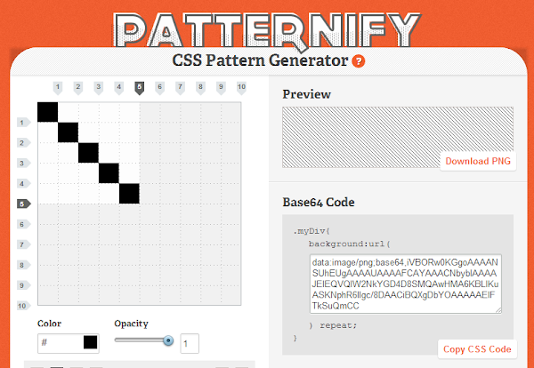

Background pattern memang sangat unik untuk dimasukkan ke dalam desain web, selain itu background pattern berpengaruh pada proses loading web karena kita hanya menggunakan pattern tidak meload sebuah background yang besar untuk menutupi seluruh halaman web. Berikut ini adalah beberapa situs penyedia background pattern.

## [subtlepatterns.com](http://subtlepatterns.com/ "Subtle Patterns")

Koleksi pattern halus, tersedia dalam file individu atau file pattern untuk photoshop!

## [stripegenerator.com](http://www.stripegenerator.com/ "Stripe Generator")

## [bgpatterns.com](http://bgpatterns.com/ "bgpatterns")

## [patternify.com](http://www.patternify.com/ "Patternify")

## [patternizer.com](http://patternizer.com/ "Patternizer")

