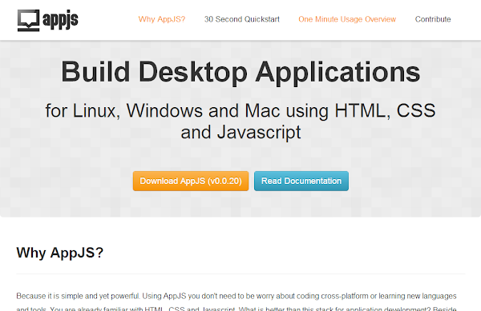
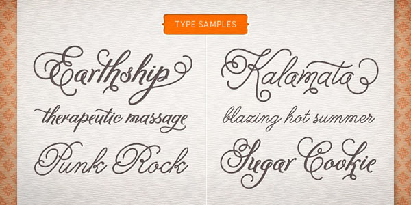
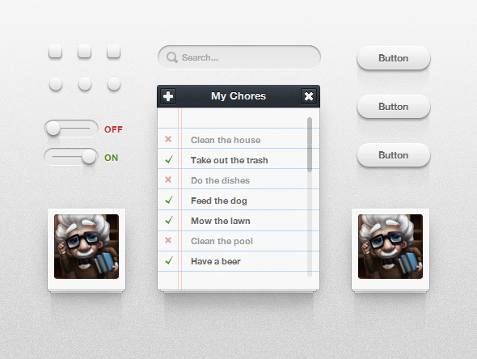
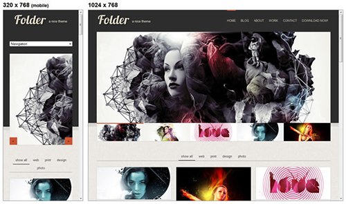

## [1\. AppJs](http://appjs.org/)

AppJs adalah framework untuk membuat aplikasi Desktop dengan menggunakan HTML-CSS dan Javascript. (diperkuat dengan Node.js)

## [2\. Apakah Responsive Desain benar-benar dibutuhkan? \[infografik\]](http://designdrizzle.com/is-responsive-web-design-really-needed-infographic/)

![Pentingkah Responsive Web [Infografik]](./images/do-you-really-need-responsive-design-info.png)

## [3\. Handwriting Fonts Pilihan](http://designmodo.com/handwriting-webfonts/)

## [4\. Icon Deposit CSS3 UI Kit (PSD+CSS)](http://www.icondeposit.com/design:100)

## [5\. 30 Template Responsive HTML/CSS Gratis](http://pixaza.com/30-free-css-html-responsive-website-templates/)

