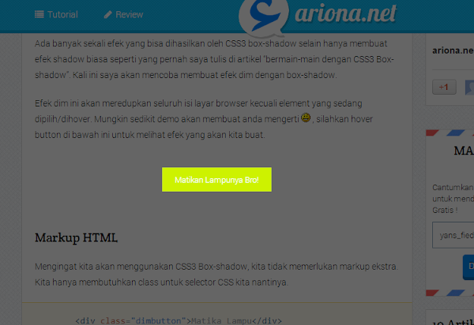

Ada banyak sekali efek yang bisa dihasilkan oleh CSS3 box-shadow selain hanya membuat efek shadow biasa seperti yang pernah saya tulis di artikel "[bermain-main dengan CSS3 Box-shadow](/bermain-main-dengan-css3-box-shadow/ "Bermain-main dengan CSS3 : Box-shadow")". Kali ini saya akan mencoba membuat efek dim dengan box-shadow.

Efek dim ini akan meredupkan seluruh isi layar browser kecuali elemet yang sedang dipilih/dihover. Mungkin sedikit demo akan membuat anda mengerti :), silahkan hover button di bawah ini untuk melihat efek yang akan kita buat.

Matiin Lampunya Bro! .dim{cursor:pointer;-webkit-transition:-webkit-box-shadow .5s ease;-moz-transition:-moz-box-shadow .5s ease;-ms-transition:-ms-box-shadow .5s ease;-o-transition:-o-box-shadow .5s ease;transition:box-shadow .5s ease;}.dim:hover{box-shadow:0 0 0 9000px rgba(0,0,0,.6);-o-box-shadow:0 0 0 9000px rgba(0,0,0,.6);-ms-box-shadow:0 0 0 9000px rgba(0,0,0,.6);-moz-box-shadow:0 0 0 9000px rgba(0,0,0,.6); -webkit-box-shadow:0 0 0 9000px rgba(0,0,0,.6); position:relative;z-index:9999999;}.single-content{overflow:visible !important;}

## Markup HTML

Mengingat kita akan menggunakan CSS3 Box-shadow, kita tidak memerlukan markup ekstra. Kita hanya membutuhkan class untuk selector CSS kita nantinya.

    

Matikan Lampu

## CSS box-shadow

Pertama-tama kita beri style untuk `.dimbutton` terlebih dahulu agar penampilannya menjadi keren.

```css
.dimbutton{
    padding:20px 30px;
    background:#9dea4f;
    color:white;
    text-shadow:0 -1px 1px rgba(0,0,0,.2);
    -webkit-transition:-webkit-box-shadow .5s ease;
    -moz-transition:-webkit-box-shadow .5s ease;
    -ms-transition:-webkit-box-shadow .5s ease;
    -o-transition:-webkit-box-shadow .5s ease;
    transition:-webkit-box-shadow .5s ease;
}   
```

[Saya](http://www.ariona.net "ariona.net tutorial web & desain") hanya memberikan style sederhana dengan menambahkan background dan [text-shadow](/bermain-main-dengan-css3-text-shadow/ "Bermain-main dengan CSS3 : Text-shadow"). Efek dari property transisi akan diterapkan pada box-shadow ([baca juga bermain-main dengan CSS3 Transition](/bermain-main-dengan-css3-transition/ "Bermain-main dengan CSS3 : Transition")).

Selanjutnya adalah trik yang menjadi pembahasan utama dalam artikel ini, efek dim. efek untuk meredupkan seluruh halaman web kecuali element yang sedang kita hover. _Penasaran?_

```html

.dimbutton:hover{
    -webkit-box-shadow:0 0 0 99999px rgba(0,0,0,.3);
    -moz-box-shadow:0 0 0 99999px rgba(0,0,0,.3);
    -ms-box-shadow:0 0 0 99999px rgba(0,0,0,.3);
    -o-box-shadow:0 0 0 99999px rgba(0,0,0,.3);
    box-shadow:0 0 0 99999px rgba(0,0,0,.3);
    position:relative;
    z-index:999999;
}
```

_Yep_, itu saja!. kita beri nilai spread sebesar `99999px` agar shadow melebar/menyebar sebesar nilai tersebut dan nilai `z-index` tersebut agar shadow berada paling atas dari seluruh halaman web (topmost), begitu juga dengan property `position:relative`.



## Kekurangan

Kekurangan yang muncul adalah ketika elemen tersebut berada di dalam element yang memiliki property `overflow:hidden`, maka efek redup hanya berlaku untuk element tersebut. Namun kita masih bisa mengakalinya dengan mengganti nilai dari property `overflow` tersebut dengan `visible`. `overflow:visible`

## Kesimpulan

Dengan hanya bermain-main dengan nilai dari property `box-shadow` anda dapat membuat efek-efek yang mengasyikkan. Kamu mengerti javascript? efek tersebut bisa menjadi lebih flexible. Masih banyak efek-efek lainya yang bisa anda buat dengan property ini, mulai dari shadow biasa sampai memberikan kesan 3D. Dilain kesempatan saya tulis juga beberapa efek lainnya.
