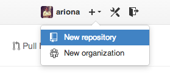
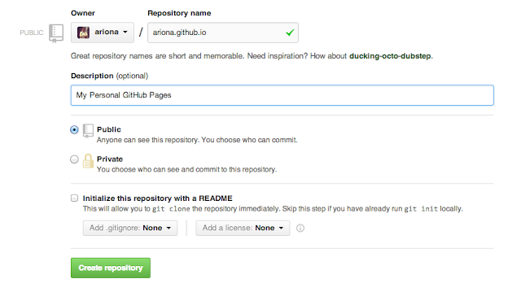
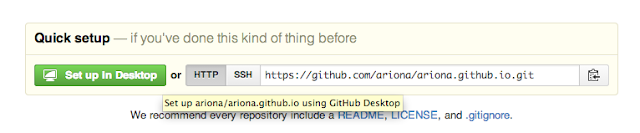
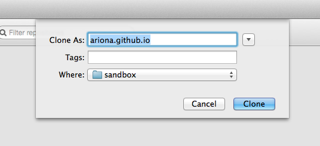
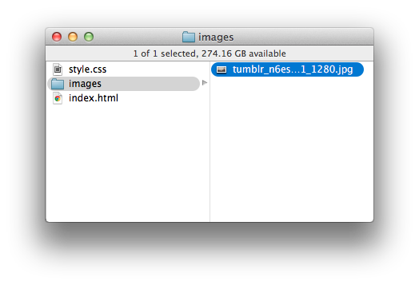
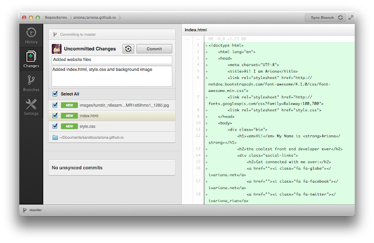

Pada [tutorial sebelumnya saya menulis tentang git](/belajar-git-yuk/ "Belajar Git yuk!"), perintah-perintah dasar git dan sekilas tentang apa itu github. Kali ini saya akan mengajak anda untuk membuat situs statis menggunakan layanan gratis dari GitHub yakni GitHub Pages.

## Apa itu GitHub Pages

Jika anda mengunjungi situs [https://pages.github.com/](https://pages.github.com/) disana tertulis Website for you and your projects, artinya GitHub Pages adalah layanan hosting website gratis untuk Anda atau project yang sedang anda kerjakan. Seluruh file website kita akan dihosting di GitHub artinya untuk melakukan perubahan Anda bisa melakukannya melalui github, atau langsung dari desktop anda melalui perintah-perintah git.

## Persiapan Website

Untuk tutorial pembuatan github page ini kita akan membuat situs bio sendiri, kita mulai membuat file HTML dan CSSnya terlebih dahulu, lalu menguploadnya ke github dan menjadikannya sebagai github page. Jika Anda penasaran seperti apa jadinya situs yang akan kita buat nanti silahkan buka link berikut:

[ariona.github.io](http://ariona.github.io)

Ok, kita sepakat kalo situs simple yang barusan anda buka itu keren ( maksa :D ), ajarin doong kakaa :)

### HTML

Pertama-tama kita buat file HTML untuk situs kita, untuk file HTML ini sangatlah simple

```html
<!doctype html>
    <html lang="en">
    <head>
        <meta charset="UTF-8">
        <title>Hi! I am Ariona</title>
        <link rel="stylesheet" href="http://netdna.bootstrapcdn.com/font-awesome/4.1.0/css/font-awesome.min.css">
        <link rel="stylesheet" href="http://fonts.googleapis.com/css?family=Raleway:100,700">
        <link rel="stylesheet" href="style.css">
    </head>
    <body>
        <div class="bio">
            <h1><em>Hi!</em> My Name is <strong>Ariona</strong></h1>
            <h2>the coolest front end developer ever</h2>
            <div class="social-links">
                <h2>Get connected with me over:</h2>
                <a href=""><i class="fa fa-globe"></i>ariona.net</a>
                <a href=""><i class="fa fa-facebook"></i>ariona.net</a>
                <a href=""><i class="fa fa-twitter"></i>ariona_rian</a>
                <a href=""><i class="fa fa-google-plus"></i>arionarian</a>
            </div>
        </div>
    </body>
</html>
```

Di atas saya menyertakan font-awesome untuk menampilkan icon-icon yang ada dalam social link. Untuk Font saya juga menambahkan Google Font dengan nama font Raleway.

### CSS

Untuk Background saya menggunakan stock foto oleh Caleb George Morris yang didapat dari unsplash.com. Jika anda ingin menggunakan background lain silahkan kunjungi unsplash.com untuk foto-foto gratis menarik lainnya. Kita simpan gambar untuk background ini ke dalam folder images. jadi buatlah folder "images" dan masukkan gambar untuk banckground ke dalamnya.

Selanjutnya kita buat file CSS untuk situs kita. Pertama-tama kita beri style global untuk body:

body{
    background-image:url(images/tumblr\_n6eszmeQMR1st5lhmo1\_1280.jpg);
    background-size:cover;
    font-family:Raleway,Open Sans,Droid Sans,arial,sans-serif;
}

Lalu kita beri style untuk .bio agar posisinya berada tepat ditengah layar. Untuk itu kita akan menggunakan teknik absolute, jadi anda harus menentukan width dan height dari .bio tersebut lalu menerapkan nilai 0 pada top,right,bottom, dan left dan margin: auto agar posisinya tepat berada di tengah.

.bio{
    width:600px;
    height:200px;
    position:absolute;
    top:0;
    left:0;
    right:0;
    bottom:0;
    margin:auto;
    text-align:center;
}

Untuk judul, kita atur ukuran font agar tidak terlalu tebal.

```css
h1,h2{
    font-weight:100;
}
h2{
    font-size:15px;
}
```

Terakhir untuk .social-links, kita tambahkan jarak atas, dan atur jarak antar icon, dan style dari link

```css
.social-links{margin-top:50px;}
a{
    color:#333;
    text-decoration:none;
}
a:hover{text-decoration:underline}
.fa{margin:0 10px;}
```

Ok, Jika semuanya telah anda ketik dengan benar, cobalah untuk membuka file index.html dalam browser, Jika sudah oke kita lanjut ke proses selanjutnya.


## Membuat Repository GitHub

Untuk membuat GitHub Pages terdapat dua pilihan, yang pertama adalah GitHub Pages untuk halaman GitHub kita dan kedua adalah GitHub Pages untuk website Project kita, kali ini saya akan membuat github pages untuk halaman GitHub kita untuk opsi yang kedua bisa anda ikuti caranya di situs pages.github.com tadi karena yang berbeda itu langkah di awalnya saja.

Tapi sebelumnya saya anjurkan untuk menginstall GitHub client terlebih dahulu karena saya akan menggunakannya untuk melakukan aktifitas git pada file-file website kita.

Login terlebih dahulu ke situs github.com, lalu buat repository baru.

[](https://picasaweb.google.com/lh/photo/DgkvcGAvp0Pk2UqFMZ9BZhU8Zk-mUyRgJWkVqUs0yrw?feat=embedwebsite)

Untuk nama repository, karena kita akan menggunakan GitHub Page untuk Halaman GitHub kita, jadi penamaannya seperti berikut:

username.github.io

Sebagai contoh, username saya adalah ariona jadi nama repository yang akan dibuat adalah:

ariona.github.io

Nama repository ini akan menjadi domain untuk mengakses GitHub Pages milik kita

Tambahkan sedikit deskripsi tentang repository yang akan kita buat, seperti gambar berikut:

[](https://picasaweb.google.com/lh/photo/qh9e6p7JmoGG_KpYSTDuARU8Zk-mUyRgJWkVqUs0yrw?feat=embedwebsite)

Jika sudah, Klik Create repository. Di halaman selanjutnya Klik tombol "Set up in Desktop" dan Aplikasi GitHub client akan muncul, tentukan dimana anda akan menyimpannya.

[](https://picasaweb.google.com/lh/photo/k1NuZ63WyP9DsKCIaG60pRU8Zk-mUyRgJWkVqUs0yrw?feat=embedwebsite) [](https://picasaweb.google.com/lh/photo/w2yMMs2xKYnIwpD78mdPIRU8Zk-mUyRgJWkVqUs0yrw?feat=embedwebsite)

Selanjutnya kita pindahkan file-file yang telah kita buat sebelumnya ke dalam folder repository kita. Karena saya tadi menyimpannya di folder ariona.github.io maka seluruh file dan folder saya masukkan ke dalamnya. kira-kira strukturnya seperti berikut:

[](https://picasaweb.google.com/lh/photo/yytfwz9kW4n8reFnxkapMBU8Zk-mUyRgJWkVqUs0yrw?feat=embedwebsite)

Jika semua file telah dipindahkan, kembali ke aplikasi GitHub client, lalu masuk ke bagian Changes, isi kolom commit dan deskripsi terserah anda, saya mengisinya dengan keterangan singkat seperti pada gambar.

[](https://picasaweb.google.com/lh/photo/KpRwWhgRMrDoC4IKZa_-ghU8Zk-mUyRgJWkVqUs0yrw?feat=embedwebsite)

Jika sudah mantap, klik tombol commit. Terakhir Pilih menu Repository > Publish untuk mensynchronkannya dengan server github. Setelah proses ini selesai Anda bisa buka alamat GitHub anda di alamat username.github.io.

## Custom Domain

Jika Anda ingin mengganti alamat website anda dengan domain yang telah anda sewa caranya sangatlah mudah. Buatlah file CNAME dan isi dengan alamat domain yang anda kehendaki. Selanjutnya atur juga DNS record domain anda agar mengarah ke IP berikut:

```
192.30.252.153
192.30.252.154
```

## Blogging dengan github-pages

Anda ingin blogging menggunakan github pages? kabar baik untuk anda. Anda dapat menggunakan Jekyll sebagai platform blogging anda di GitHub Pages, namun saya tidak akan membahasnya di tutorial ini, mungkin akan saya tulis ditutorial selanjutnya.

## Kesimpulan

GitHub Pages bisa menjadi solusi gratis untuk anda yang ingin membuat situs sendiri atau untuk anda yang ingin bereksperimen dengan situs statis, Anda juga mendapatkan manfaat lain dari penggunaan Git sebagai version control untuk situs Anda. Jika anda ingin mengganti alamat domain, Anda bisa dengan mudah melakukannya namun perlu diingat bahwa sewa domain itu tidaklah gratis :) . Jika Anda bermaksud menggunakan GitHub Pages sebagai tempat blogginpun sangat bisa dilakukan dengan bantuan jekyll. Seluruh kode situs anda dapat dilihat, dicopy oleh orang lain, dan asyiknya orang lain juga bisa ikut berkontribusi atau langsung melaporkan jika anda yang salah dengan situs anda.

Jika Anda tidak source code situs anda bisa dilihat oleh orang lain, Anda harus mengatur repositorynya ke mode private, dan untuk itu anda akan dikenakan biaya karena GitHub hanya menyediakan versi free untuk project yang persifat Open Source saja.
