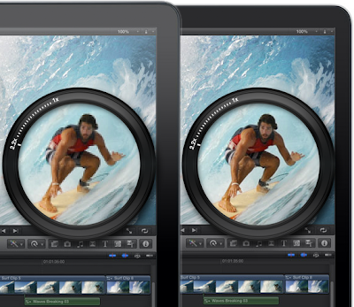
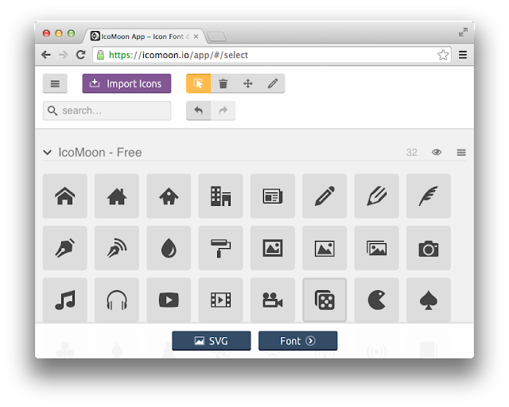
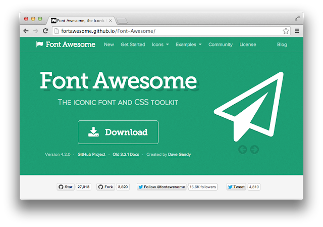
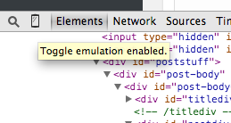
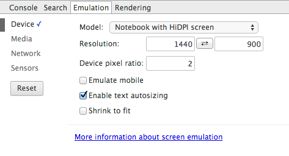
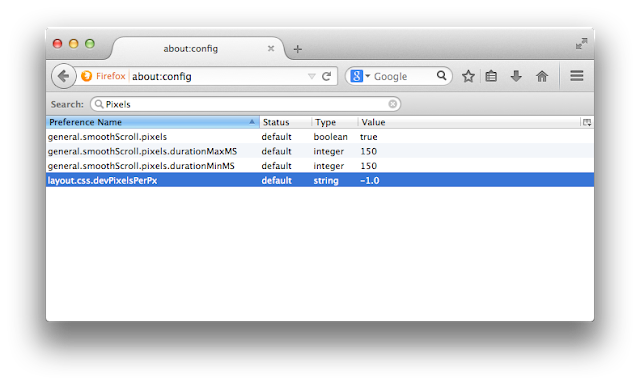
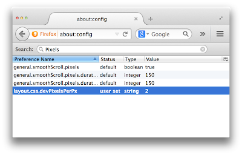

Retina Display merupakan istilah yang digunakan oleh Apple untuk layar monitor yang memiliki resolusi dan pixel yang sangat tinggi. Dengan kata lain, selain memiliki resolusi yang tinggi, kepadatan pixel per inchnya juga sangat tinggi biasanya mencapai dua kali lipat dari monitor biasa. Dari informasi tersebut, bisa kita sederhanakan bahwa untuk mendukung retina display maka, kita harus memiliki resource dengan resolusi dua kali lipat dari yang sekarang.



Dalam web, perubahan yang sangat mencolok ketika menggunakan retina display adalah resource berupa image yang terlihat pecah, karena resolusinya yang kecil. Dan jika kita ingin memberikan dukungan terhadap Retina Display, maka kita harus menyediakan pula image dengan resolusi 2x lipat dari asalnya.

Sebagai contoh, saya memiliki image logo dengan ukuran **150x150px**, nah untuk retina display maka ukurannya adalah dua kali lipatnya, yakni **300x300px**. Jadi ketika user menggunakan retina display, maka image inilah yang akan digunakan sehingga kualitas gambar masih bagus. Lalu bagaimana cara mengganti link image secara otomatis?

## Retina.js

[Retina Js](http://imulus.github.io/retinajs/ "Retina.js") adalah library kecil untuk menghandle resource untuk retina display, library ini akan secara otomatis mencari image yang diperuntukkan khususu untuk retina display, jika ada maka retina.js akan mengganti source image dengan source untuk retina.

Penggunaanya sangat mudah, pertama-tama anda harus menyediakan image untuk retina display, dan menambahkan akhiran **@2x** pada nama file. Misalnya untuk **logo.png** kita sediakan pula file **logo@2x.png** yang telah dirubah resolusinya menjadi dua kali lipat.

Selanjutnya adalah menyertakan library retina.js pada dokumen HTML kita.

```
http://retina.js
```

## Bagaimana dengan Resource Lainnya atau Layout Web

Pada dasarnya yang akan terasa ketika menggunakan Retina Display hanya pada Image, Jadi untuk Font akan secara otomatis menyesuaikan dan akan terlihat tajam seperti biasanya. Gunakanlah Webfont, dan [CSS3 font-face](/bermain-main-dengan-css3-font-face/ "Bermain-main dengan CSS3 : font-face") jika anda ingin menggunakan non-web safe font. Font-font seperti yang disedikan Google Font bisa menjadi pilihan tepat.

Jika anda menggunakan image untuk icon-icon dalam web anda, saya sarankan untuk menggunakan font-icon, agar tiap icon tetap terlihat tajam, tanpa perlu menambah asset image. Untuk memilih icon berupa font, Anda bisa mencarinya diinternet. Banyak sekali font icon yang bisa anda download secara cuma-cuma, seperti [FontAwesome](http://fortawesome.github.io/Font-Awesome/ "FontAwesome") dan [icomoon.io](https://icomoon.io/app "Icomoon App").




Untuk layout web, tidak ada perubahan sama sekali hanya saja karena resolusi monitor yang besar (2000px lebih) maka layout web anda akan terlihat kecil. Semuanya tergantung pada anda, apakah anda ingin menyesuaikan dengan resolusi yang besar atau membiarkannya apa adanya. Jika anda ingin menyesuaikannya, Anda bisa menggunakan CSS3 media query, jadi pada dasarnya adalah menyediakan versi responsive untuk resolusi 2000 ke atas :D, Silahkan baca artikel tentang [responsive web disini](/responsive-webdesign-apa-dan-bagaimana/ "Responsive Webdesign, Apa dan Bagaimana ?")

## Simulasi Retina Display

Saya sendiri tidak memiliki device Retina Display, jadi agak susah untuk mengujinya. Namun jangan berkecil hati, banyak jalan menuju roma, begitu pula banyak jalan untuk mensimulasikan Retina Display pada Monitor Non-Retina Display.

### Simulasi Pada Browser

Setiap browser memiliki fitur yang berbeda untuk simulasi Retina Display, Saya akan memberikan tips untuk simulasi Retina Display pada Google Chrome dan Firefox.

#### Google Chrome

Pastikan anda mendownload Google Chrome versi terbaru, saya tidak ingat sejak versi berapa fitur ini ditambahkan. Buka Developer Tools, dengan cara mengklik kanan lalu pilih Inspect Element, atau dari Chrome menu>Tools>Developer Tools.

Lalu klik icon Mobile (Toggle emulation enabled) untuk mengaktifkan Emulation Setting panel.



Pilih Model Notebook with HiDPI Screen, atau model apa saja, asalkan Opsi Device Pixel ration dirubah menjadi 2.



Yep, selesai, kini halaman web yang sedang anda buka sedang disimulasikan menggunakan retina Display. Jika anda menggunakan retina.js seperti yang telah saya tuliskan diatas, silahkan inspect element image yang telah anda buat versi retina display dan perhatikan, linknya telah berubah mengarah ke file dengan akhiran @2x.

#### Firefox

Untuk Firefox, prosesnya agak berbeda, begitu pula dengan hasil yang didapat. Caranya adalah dengan menavigasikan halaman web ke about:config. lalu cari Preference Name layout.css.devPixelsPerPx.



Klik dua kali dan masukkan nilai 2. Nilai 2 ini sama halnya dengan Google Chrome, kita menambahkan 2x lipat dari pixel densitynya. Klik Ok untuk menyimpan pengaturan dan jika sukses. Tampilan Firefox anda akan membengkak :D. Yep, Seluruh user interface Firefox menjadi dua kali lipat ukuran biasa. Agak aneh memang :D tapi kiti firefox anda sudah jadi Retina Display.



## Kesimpulan

Meskipun penggunaan Retina Display masih sangat sedikit, tapi ada baiknya jika kita juga ikut mendukung Retina Display, karena caranya juga tidak terlalu rumit. Untuk resource berupa image, anda tinggal membuat versi yang lebih tinggi yakni dua kali lipat dari resolusi awal, menambahkan akhiran @2x dan menambahkan library retina.js. Penggunaan font-icon juga dapat menyederhanakan proses penggunaan icon yang tetap tajam ditampilkan pada Retina Display, So sebisa mungkin gunakan Font-icon untuk mengurangi penggunaan resource image. Untuk Anda yang tidak memiliki retina displaypun anda masih bisa mengujinya dengan mengatur browser yang anda gunakan untuk pengujian retina display.
