Developer Tools dalam setiap browser adalah tool yang paling dibutuhkan oleh para developer web. Karena dengan tool tersebut kita bisa menginspeksi masing-masing element, melihat style yang diterapkan, melihat script apa saja yang digunakan dan masih banyak lagi.

Jika dalam Desktop/Komputer kita hanya perlu melakukan klik kanan dan inspect element, atau dengan mengaksesnya lewat menu yang disediakan, lalu bagaimana jika kita ingin meng-"_inspect element_" atau melakukan debugging pada browser mobile? seperti Google Chrome for Android/iOS atau Safari misalnya?

_Debugging_ web pada mobile device dikenal dengan istilah **Remote Debugging**, dan pada artikel ini saya akan menjelaskan cara melakukan remote debugging pada device Android Menggunakan browser Google Chrome dan Device iOS dengan menggunakan browser Safari.

## Android & Google Chrome

Untuk melakukan remote debugging Chrome for Android ada beberapa syarat yang harus dipenuhi, yaitu:

1. Google Chrome versi 32 atau terbaru terinstall pada komputer
2. Kabel USB untuk konektifitas Android dan Komputer
3. Android 4.0 (Kitkat) ke atas dan Chrome for Android

Jika semuanya sudah siap silahkan ikuti langkah-langkah berikut:

1. Aktifkan Developer Mode pada Android, dengan menyentuh **build number** sebanyak **7x**. Build Number bisa ditemukan di menu **Settings -> About Phone -> Software Information**.
    
    
    
2. Jika Developer Mode sudah aktif, anda akan menemukan menu Developer Options di Settings. Klik menu tersebut.
3. Cari option USB debugging dan aktifkan
    
    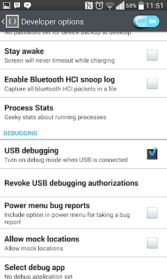
    

Dengan mengaktifkan option USB debugging kini anda dapat melakukan remote debugging Chrome for Android melalui Google Chrome di komputer anda. Langkah selanjutnya adalah membuka Google Chrome di komputer lalu buka alamat berikut:

``
about:inspect
``

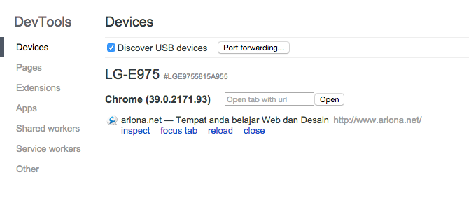

Setelah itu koneksikan Android anda dengan komputer menggunakan kabel USB. Anda akan diminta untuk mengizinkan komputer anda melakukan remote debugging pada android anda. Sentuh checkbox "Always allow from this computer" dan tap OK.

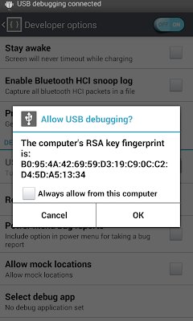

Sekarang buka Chrome for Android, dan buka alamat web yang ingin anda inspect. Jika semua langkah tersebut sudah benar, anda akan melihat tab yang sedang dibuka di Android anda.

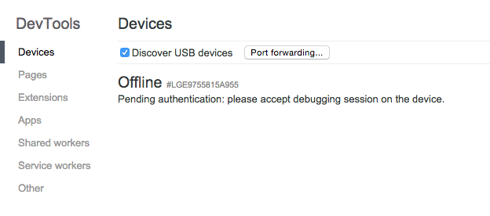

Klik link inspect untuk membuat Developer Tools.

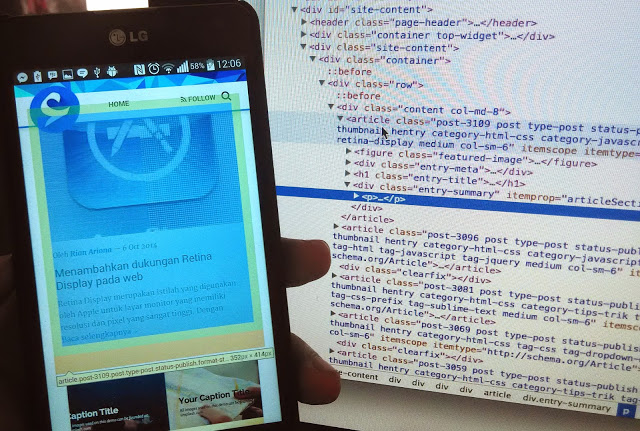

Yang lebih mengaksyikkan dari Chrome ini adalah kita bisa melihat dan meremote android dengan mengaktifkan **_"Switch to potrait screencast"_** yang terdapat di pojok kanan atas.

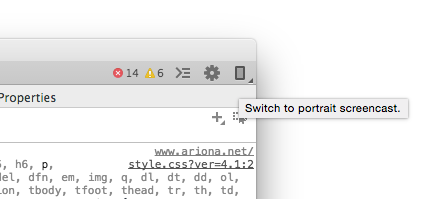

Setelah anda mengaktifkannya maka, layar android anda akan ditampilkan disisi sebelah kiri. fitur ini sangat membantu, anda tidak perlu lagi melihat Android anda melainkan langsung remote dari chrome di komputer anda.

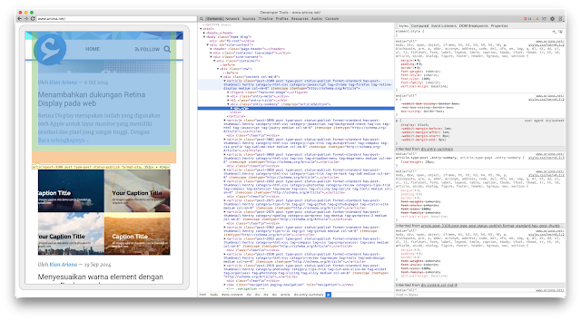

## iDevice & Safari

Untuk iDevice (iPhone, iPod, iPad), langkahnya sangat sederhana. Pertama-tama anda harus mengaktifkan terlebih dahulu opsi Web inspector di perangkat mobile anda.

1. Buka Settings, lalu cari safari
    
    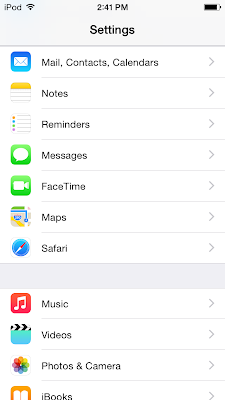
    

3. Buka menu Advanced (biasanya terletak di paling bawah).

5. Aktifkan Web Inspector
    
    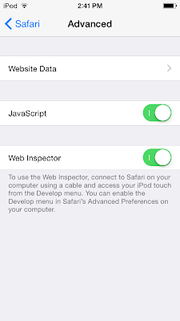
    

Selanjutnya adalah mengaktifkan Developer menu di Safari Mac anda. Buka menu **Safari->Preferences**. Pada tab Advanced beri checklist pada opsi **Show Develop menu in menu bar**

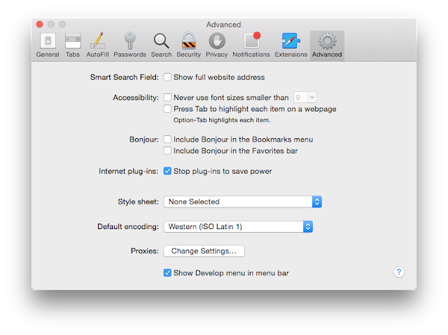

Jika menu Develop sudah muncul, Anda akan melihat device yang terhubung dengan mac dan tab yang sedang dibuka

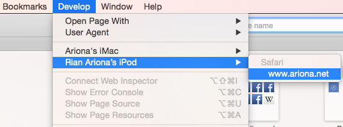
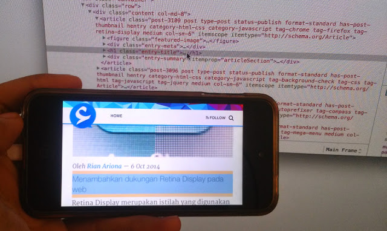

## Kesimpulan

Sekarang anda sudah mengetahui bagaimana cara melakukan _debugging_ pada mobile device. Yakni dengan menggunakan Google Chrome untuk device Android dan Safari untuk iDevice. Keduanya memang sangat membantu dalam proses debugging atau mencari kesalahan-kesalahan yang muncul dalam mobile device. Saya sendiri lebih senang menggunakan Google Chrome untuk prosees debugging ini karena ada fitur screencast/menampilkan layar android di Chrome jadi kita tidak perlu lagi berinteraksi dengan devicenya.

Sedangkan untuk safari kelebihannya terletak pada proses setup yang lebih sederhana. Dan jika anda tidak dapat melakukan remote Debugging di chrome, pastikan driver device Android anda sudah terinstall karena pada beberapa kasus device tidak bisa terhubung dengan benar.

## Sumber

- [Google Chrome Developer Website](https://developer.chrome.com/devtools/docs/remote-debugging "Google Chrome Remote Debugging")
- [Apple Developer Website](https://developer.apple.com/safari/tools/)
