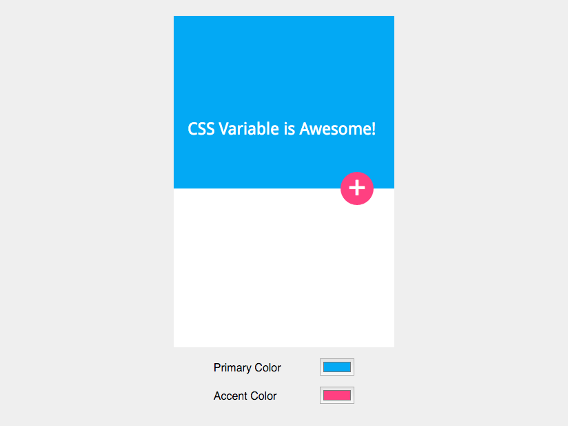

Jika anda menggunakan CSS processor seperti SASS atau less pastinya anda akan merasa terbantu dengan adanya fitur CSS variable.

Karena kita dapat mendefinisikan terlebih dahulu _value-value_ yang akan sering dipakai kedalam variable. Lalu menggunakan variable tersebut dalam style yang anda kerjakan.

Keuntungannya adalah ketika anda ingin merubah _value_ tersebut, anda hanya tinggal meng_update_ nilai dari variable tertentu tanpa harus mengupdatenya satu persatu.

Tapi yang menjadi kekurangannya adalah kita harus mengcompile file SASS/Less kita agar bisa digunakan di browser.

Pada tutorial kali ini, saya akan memperkenalkan CSS Custom Properties atau lebih dikenal dengan CSS Variable. Yap, yang ini variable asli bawaan CSS.

## Mengenal CSS Variable

Nama resminya adalah **CSS Custom Properties**, karena jika diperhatikan cara pendeklarasiannya lebih mirip deklarasi property biasa. Hanya saja nama propertynya terserah kita.

Seperti halnya variable dalam CSS Preprocessor, kita dapat mendeklarasikan variable-variable yang akan sering kita gunakan dalam project kita.

Bedanya, kita tidak memerlukan lagi CSS Preprocessor agar style kita bisa digunakan langsung oleh browser.

### Deklarasi variable

Untuk mendeklarasikan variable kita tinggal menggunakan `--`(double dash/strip) sebelum nama variable. misal:

```css
--primary-color: #03A9F4;
--accent-color: #FF4081;
--base-font-size: 12px;
```

Mudah bukan? Lalu dimana saya harus meletakkan deklarasi variabel tersebut?

### Lokasi Deklarasi

Agar variable yang kita deklarasikan bisa diakses secara global, maka kita dapat meletakkannya dalam selector `:root` ([Baca selengkapnya tentang selector :root](https://css-tricks.com/almanac/selectors/r/root/)):

```css
:root{
    --primary-color: #03A9F4;
    --accent-color: #FF4081;
    --base-font-size: 12px;
}
```

Anda juga dapat mendeklarasikannya secara local/dalam selector:

```css
.card{
    --card-background: #FEFEFE;
}
```

Mendeklarasikan variable secara local, membuat variable tersebut hanya bisa diakses dalam selector tersebut atau child dari selector yang bersangkutan.

### Penggunaan Variable

Untuk menggunakan variable yang telah dideklarasikan, kita akan menggunakan function `var()`, misal:

```css
:root{
    --primary-color: #03A9F4;
    --accent-color: #FF4081;
    --base-font-size: 12px;
}

.site-header{
    background-color: var(--primary-color);
}
.fab{
    background-color: var(--accent-color);
}
```

Function `var()` ini juga bisa memiliki lebih dari satu argumen. Argumen selanjutnya akan dijadikan _fallback_ jika argumen sebelumnya belum dideklarasikan:

```css
.site-header{
    background-color: var(--primary-color, #FAFAFA);
}
```

Pada contoh diatas, jika variable `--primary-color` belum dideklarasikan maka nilai selanjutnyalah (`#FAFAFA`) yang akan digunakan.

Adanya fallback ini adalah meminimalisir error ketika variabel belum didefinisikan. Karena jika variabel belum didefinisikan nilai yang akan digunakan adalah initial/default dari property yang bersangkutan. Misal:

```css
.site-header{
    background-color: var(--secondary-color);
}
```

Karena kita belum mendeklarasikan variable `--secondary-color` maka nilai yang akan digunakan adalah transparent (nilai default dari background-color).

## Keunggulan

Seperti yang telah saya sebutkan sebelumnya, dengan adanya CSS Variabel native/bawaan maka style dalam project kita bisa lebih dinamis.

Misalkan anda membuat sebuat template, dan ada menyediakan sebuah customizer untuk merubah warna utama yang digunakan. Anda tinggal merubah nilai CSS variable tanpa harus membuat file khusus atau mengedit souce css/sass.

## Study Kasus

Untuk study kasus, disini saya membuat sebuah tampilan sederhana, dan sebuah customizer untuk mengganti warnanya.

### HTML

Untuk markup HTML, sederhana saja. Disini saya ingin membuat sebuah tampilan mobile app a la material design :). Lalu dibawahnya saya tambahkan dua input color, untuk merubah warna:

```html
<div class="mobile-screen">
    <div class="hero">CSS Variable is Awesome!
    <div class="fab">+</div>
  </div>
</div>
<div class="customizer">
    <label for="primary">Primary Color</label>
    <label for="accent">Accent Color</label>
</div>
```

### CSS

Untuk style juga sederhana.

```css
:root {
    --primary-color: #03A9F4;
    --accent-color: #FF4081;
}

body{
    background-color: #efefef;
    min-height: 100vh;
    display: flex;
    flex-direction: column;
    justify-content: center;
    align-items: center;
}

.mobile-screen{
    width: 320px;
    height: 480px;
    background-color: white;
}

.hero {
    position: relative;
    height: 250px;
    background-color: var(--primary-color, #e3e3e3);
    color: white;
    font-size: 1.5em;
    font-family: "Droid Sans";
    box-sizing: border-box;
    padding: 150px 20px 30px;
}

.fab {
    width: 48px;
    height: 48px;
    background-color: var(--accent-color, #bad455);
    border-radius: 50%;
    position: absolute;
    right: 30px;
    bottom: -24px;
    color: white;
    text-align: center;
    font-size: 2em;
    line-height: 1;
}

.customizer label{
    width: 150px;
    display: inline-block;
}
```

Yang perlu diperhatikan adalah deklarasi variable pada selector :root, dan penggunaannya pada `.hero` dan `.fab` untuk merubah `background-color`.

### Javascript

Yep, untuk interaksi kita harus memakai Javascript:

```js
var body = document.body,
    primaryColorInput = document.getElementById('primary'),
    accentColorInput = document.getElementById('accent'),
    primaryColor = '--primary-color',
    accentColor = '--accent-color';

// Menambahkan event ketika input color berubah
primaryColorInput.addEventListener('change', function (e) {
    // Update custom property --primary-color
    body.style.setProperty(primaryColor, e.target.value);
});
accentColorInput.addEventListener('change', function (e) {
    // Update custom property --accent-color
    body.style.setProperty(accentColor, e.target.value);
});
```

Untuk mengupdate custom property alias css variable, kita bisa menggunakan `document.body.style.setProperty` dengan argument custom property dan valuenya.

Sekarang coba buka study kasus tersebut di browser anda, atau anda bisa membuka link berikut untuk demonstrasinya.

[](http://codepen.io/ariona/pen/WwgdQr)

CSS Variable / Custom Property Demo

<div class="codepen-iframe">
    <iframe src="http://codepen.io/ariona/embed/WwgdQr" frameborder="0"></iframe>
</div>

[Demo Codepen](http://codepen.io/ariona/pen/WwgdQr)

Ketika kita merubah primary color maka background pada hero berubah sesuai dengan yang kita pilih. Begitu pula ketika kita merubah warna accent color.

Dan bisa anda perhatikan kita tidak perlu merubah file CSS kita hanya untuk mengganti warna tertentu. Tentunya untuk projek kecil ini tidak akan begitu terasa, namun beda ceritanya jika projek yang dikerjalan lebih besar :).

## Compatibility

Loh, memangnya sudah disupport semua browser ya? Jika kita cek di situs [caniuse.com](http://caniuse.com/#feat=css-variables) hampir semua browser modern telah mensupportnya. Yaa yang belum support juga banyak si, hehe. So pergunakan dengan bijak yo.

## Referensi

- [W3C: CSS Custom Properties for Cascading Variables Module Level 1](https://www.w3.org/TR/css-variables/)
