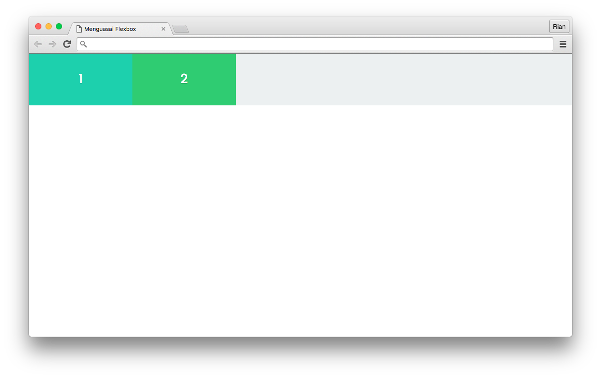
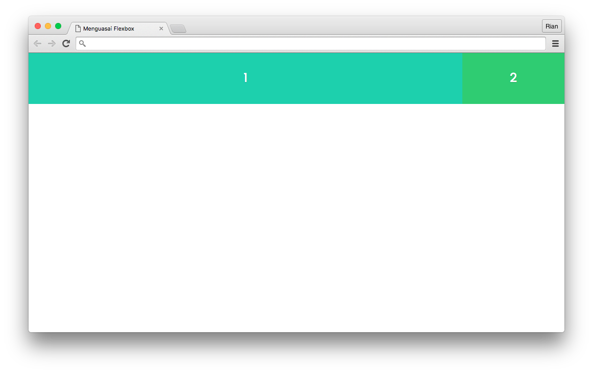
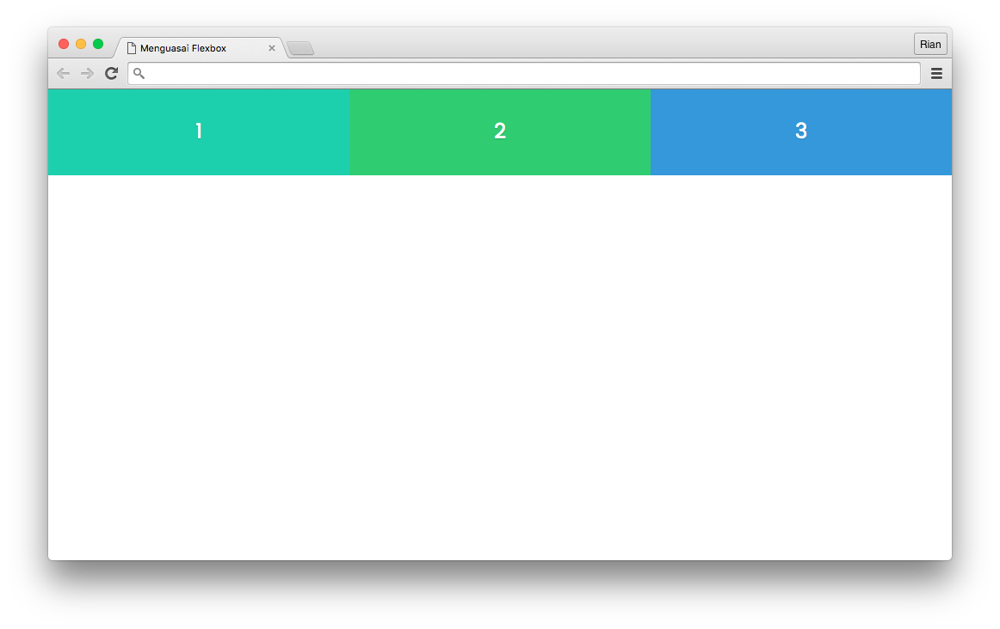
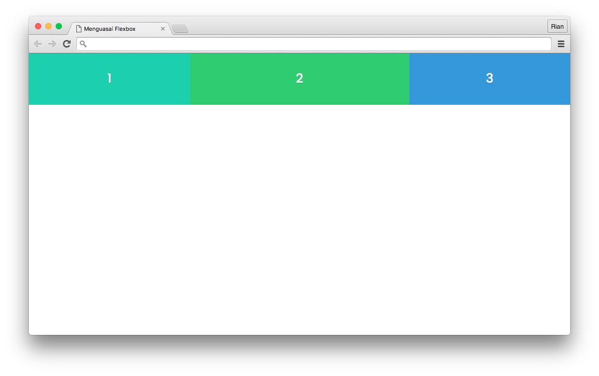
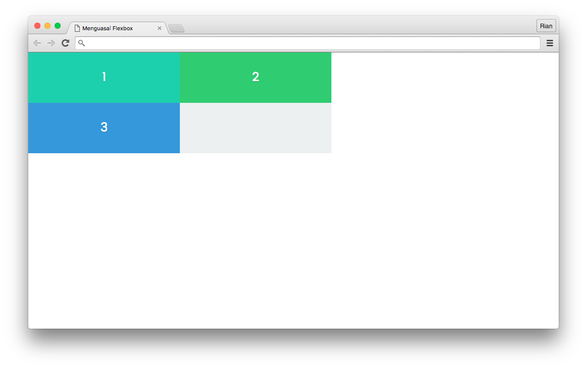
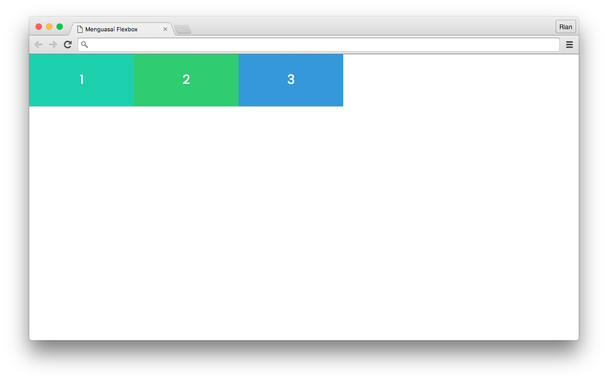
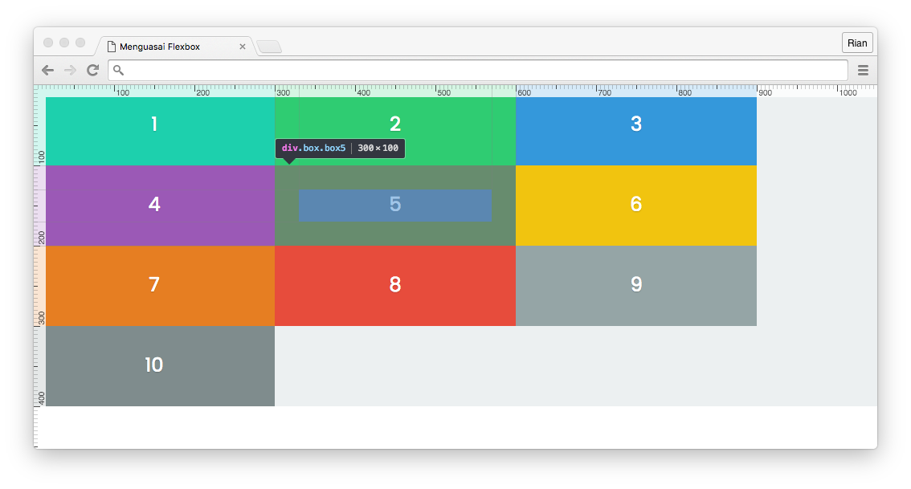
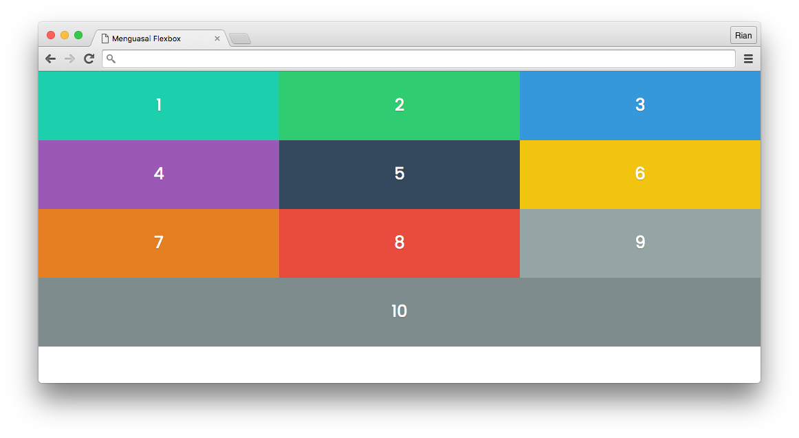
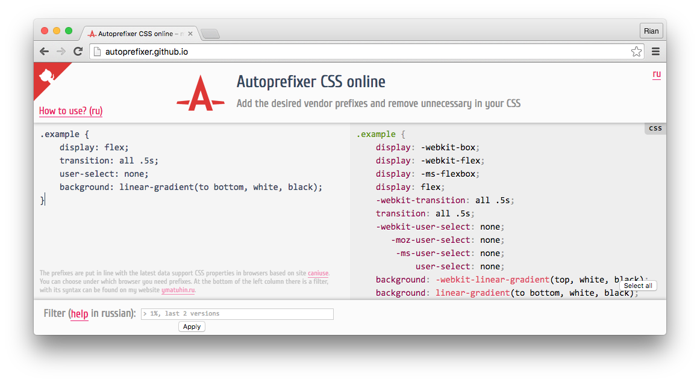

Di [bagian pertama dari tutorial Menguasai Flexbox Layout ini](/menguasai-flexbox-layout/), Kita telah mempelajari tentang _Flex Container_, _Flex Direction_, _Items Alignment_ dan _Order_.

Di bagian kedua, kita akan mempelajari tentang _Flex Grow_, _Shrink_ dan _Basis_ lalu menambahkan dukungan pada spesifikasi flexbox lama dengan autoprefixer.

Untuk File Demonstrasi bisa didownload di github saya

[Tutorial Flexbox Layout](https://github.com/ariona/tutorial-flexbox-layout)

## Flex Grow

Sudah kita ketahui bahwa dengan flexbox maka item-item yang ada di dalam flex container akan memiliki width/height flexible. Namun, tentunya kita masih bisa mengontrol ukuran dari flex item tersebut.

`flex-grow` adalah property yang diterapkan pada flex item, berfungsi untuk mengatur ukuran berdasarkan seberapa besar _space_ kosong yang akan diambil dari flex-container.

Untuk mendemonstrasikannya, masih menggunakan file demo dari bagian pertama, hanya saja saya telah merubah banyak item menjadi 2 item saja.



Seperti yang kita lihat dalam preview, kita memiliki space kosong pada container kita.

Sekarang kita coba menambahkan property `flex-grow` pada `.box1`:

```css
.box1{
    flex-grow: 1;
}
```

Bisa anda perhatikan, sekarang box1 akan memenuhi space kosong pada container. Nilai yang bisa kita gunakan pada property ini sama halnya dengan value pada property `order`.



Untuk lebih memahami akan `flex-grow` ini, kita ubah demo kita menjadi 3 item. Lalu hapus rule untuk `.box1` dan menerapkan `flex-grow` pada `.box`

```css
.box{
    flex-grow: 1;
}
```

Maka hasil yang kita dapatkan adalah, width dari item akan berubah dan akan memenuhi container.



Oke, sekarang kita coba tambahkan `flex-grow: 2` pada `.box2`

```css
.box2{
    flex-grow: 2;
}
```

Sekarang `.box1` akan memiliki lebar dua kali lebih besar dari item lainnya.



Dari sini bisa kita simpulkan bahwa, flex-grow akan memaksa item yang bersangkutan untuk menghabiskan space kosong dari container. Semakin besar nilai yang diberikan, semakin besar pula sisa space yang didapat dari item lainnya.

Analoginya teknisnya seperti ini, jika kita memiliki space kosong pada container sebesar 300, maka space 300 tersebut akan dibagikan kepada tiap item (dalam kasus ini 3 item) 100.

Lalu pada item2 kita atur flex-grownya menjadi dua, ini berarti item 2 akan mendapatkan jatah 2kali lebih banyak dari item lainnya. Kalkulasinya menjadi 300/4 (ini karena item-2 mendapat jatah dua kali lebih banyak), So item lain mendapat 75, sedangkan item2 mendapat 150.

```
item-1 = 75
item-2 = 75+75 (dapet jatah 2 kali lebih banyak)
item-2 = 75
-------------
Total    300
```

Lo lo lo ko jadi ada matematikanya :D, Tenang saja, sederhananya jika kita kasi flex-grownya 2 berarti dia bakal dapat jatah 2 kali lebih banyak. 3 berarti 3 kali lebih banyak. dst dst. :D

 

## Flex Shrink

Nah kalo flex-shrink ini kebalikan dari flex-grow. Jika flex-grow akan membagikan sisa space pada item-itemnya maka flex-shrink ini berfungsi untuk mengurangi ukuran dari item-itemnya jika space yang ada tidak muat.

Oke, kita rubah lagi style demonya menjadi seperti semula. Tiga item flexbox tanpa flex-grow. Kita rubah width .container menjadi 600, dan .box menjadi 300.

```css
.container{
  display: flex;
  width: 600px;
}
.box{
  width: 300px;
}
```

Oke, jika anda perhatikan preview berikut:



Tentunya item tidak akan muat ke dalam container kita, sehingga item ke tiga turun.

Selanjutnya kita tambahkan flex-shrink pada `.box`.

```css
.box{
  width: 300px;
  flex-shrink: 1;
}
```

Dengan menambahkan `flex-shrink` maka flex-box akan memaksa item untuk mengurangi ukuran itemnya agar muat ke dalam container.



Perhitungan banyak ukuran yang dikurangi, sama halnya dengan banyak ukuran yang ditambahkan pada flex-grow. Bedanya sekarang dikurangi :D.

Oke, saya jelaskan secara matematikanya ya (Oh tidaak :D). Kelebihan pada container kita sekarang adalah 300, karena itemnya memiliki width 300 sedangkan container hanya berukuran 600.

Dengan menambahkan `flex-shrink` maka item akan dipaksa mengurangi ukurannya sesuai dengan kelebihan tadi secara merata. Dalam kasus ini: kelebihan 300 dibagi 3 menjadi 100. Maka item akan dipaksa mengurangi ukurannya sebesar 100.

Sekarang kita coba tambahkan flex-shrink: 2 pada `.box2`, dan bisa anda tebak seberapa besar ukuran yang akan dikurangi? Yep 2 kali lebih besar dari item lain. Itung-itungannya liat flex-grow diatas ya :D.

## Flex Basis

Property `flex-basis` ini berfungsi untuk mengatur ukuran awal dari flex-item. Sebenarnya property Ini hampir sama dengan width & height, namun flex-basis akan mengatur ukuran sesuai dengan main-axisnya. Jika main axisnya horizontal maka flex-basis akan mengatur width dan sebaliknya untuk vertical.

Untuk mendemonstrasikannya, saya coba mengembalikan item demo kita ke asalnya, lalu saya hapus pula width dari `.box` karena kita akan menggunakan property flex-basis.

Selanjutnya pada container kita beri flex-wrap: wrap dan pada .box kita atur flex-basisnya menjadi 300px.



Jika kita lihat di browser, Meskipun kita tidak memberikan width, tetapi setiap box memiliki width 300px, karena kita mengaturnya dengan flex-basis.

## Flex Shorthand

Untuk property `flex-grow`, `flex-shrink` dan `flex-basis` ini memiliki property shorthand nya, yakni property flex. urutan valuenya adalah:
```css
flex: grow shrink basis
```
Contoh penggunaannya:
```css
flex: 1 0 300px;
```
Yang berarti `flex-grow` untuk itemnya 1, lalu kita tidak akan mengurangi ukuran item dengan `flex-shrink` 0 dan basis ukuran itemnya 300px;



Pada demo diatas, saya menambahkan `flex-wrap: wrap` pada container, sehingga box yang tidak muat akan dipindahkan kebawah. Dan karena kita menambahkan flex-grow pada setiap box, Maka setiap box akan mengisi space kosong. Coba perhatikan box ke 10, karena dia berada dibawah sendiri dan tentunya bakal tersedia ruang kosong, maka box-10 akan menghabiskan space tersebut sendirian. :D

## Autoprefixer

Meskipun browser modern telah mendukng flexbox secara penuh, namun kita juga perlu memberikan dukungan untuk versi browser sebelumnya. Dan tentunya ada perbedaan penulisan pada property flexbox ini. Baik itu berupa penambahan prefix atau pemakaian spesifikasi lama sehingga nama propertynya sedikit berbeda.

Untuk menyelesaikan permasalahan tersebut, kita bisa menggunakan autoprefixer untuk menambahkan prefix pada property flexbox ini secara otomatis.

Disini saya hanya akan menggunakan [tools autoprefixer online](http://autoprefixer.github.io/). Mungkin dilain waktu saya akan membahas integrasi autoprefixer pada build tools seperti gulp atau penggunaan lewat cli.

Tools yang akan kita gunakan adalah [autoprefixer.github.io/](http://autoprefixer.github.io/). Caranya anda cukup meng-_copy_ dan _paste_ kode CSS kita, lalu secara otomatis code css kita akan diberikan prefix.



Jika anda perhatikan dibagian bawah situs, terdapat pengaturan versi browser berapakah yang ingin anda support. Anda tinggal memilah sesuai spesifikasi pekerjaan anda :)

## Rangkuman Tutorial Flexbox Layout bagian 2

Oke, kita rangkum semua yang kita pelajari dibagian ini + apa yang kita pelajari dibagian pertama. Dan kita punya tabel lengkap untuk acuan property & value flexbox:

#### Property-property untuk flex container

Property | Value
--- | ---
display | flex, inline-flex
flex-direction | row(default), row-reverse, column, column-reverse
flex-wrap | nowrap, wrap, stretch
justify-content | flex-start, flex-end, center, space-between, space-around
align-items | stretch, flex-start, flex-end, center, baseline
align-content | stretch, flex-start, flex-end, center, space-between, space-around

#### Property-property untuk flex item

Property | Value
--- | ---
order | number
flex-grow | number
flex-shrink | number
flex-basis | unit(px, %)
flex | grow shrink basis
align-self | auto \| stretch \| center \| flex-start \| flex-end \| baseline \| initial \| inherit

## Penutup Bagian kedua

Oke, materi dasar tentang flexbox layout telah kita pelajari, paling tidak anda sudah tahu basic/dasar dari penggunaan flexbox. Dibagian selanjutnya kita akan mulai ke Studi Kasus Flexbox. Yap, tidak cukup dengan mengetahui dasarnya saja untuk memahami flexbox, Agar lebih paham dan tau kapan kita bisa memanfaatkan flexbox kita coba dengan Studi Kasus masalah-masalah yang bisa diselesaikan dengan flexbox.
