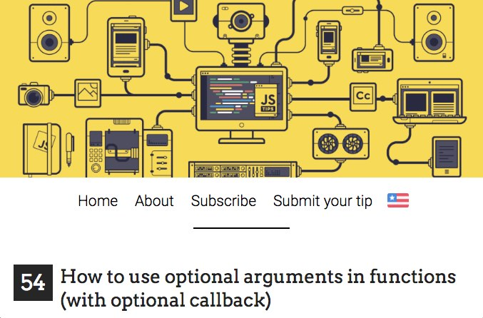
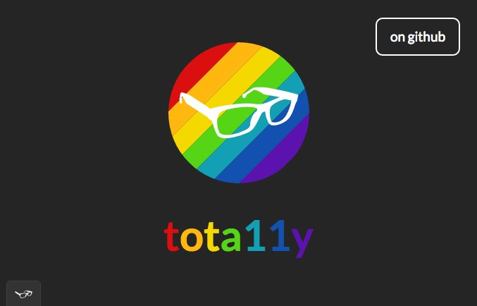
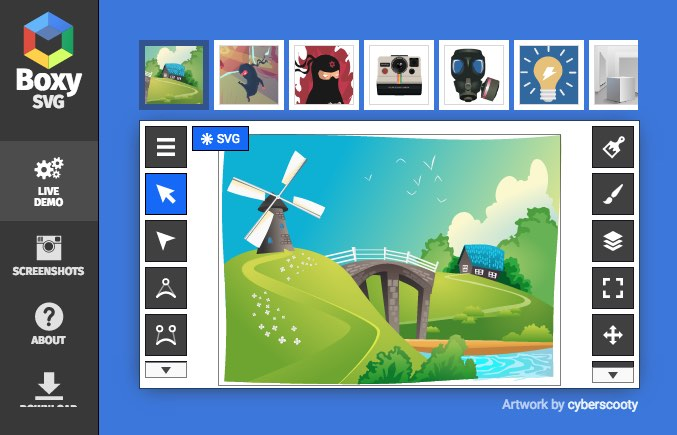
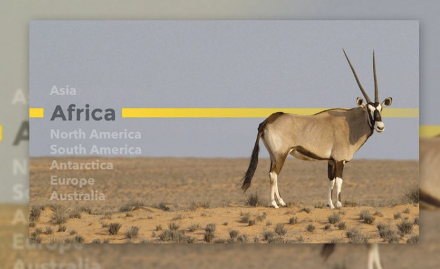
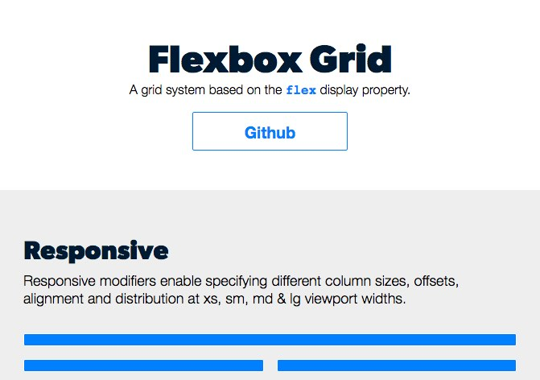
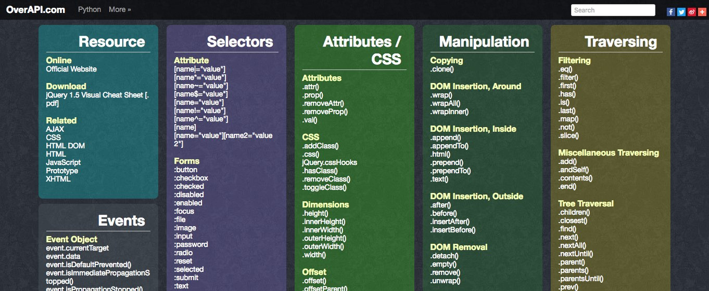
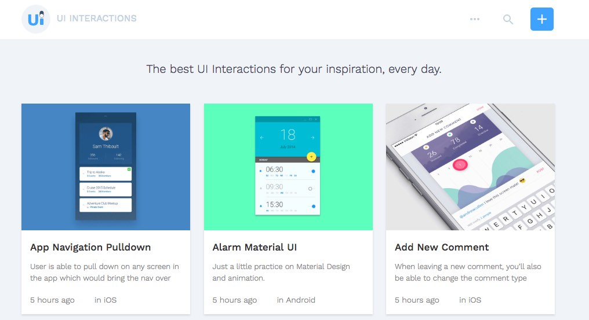
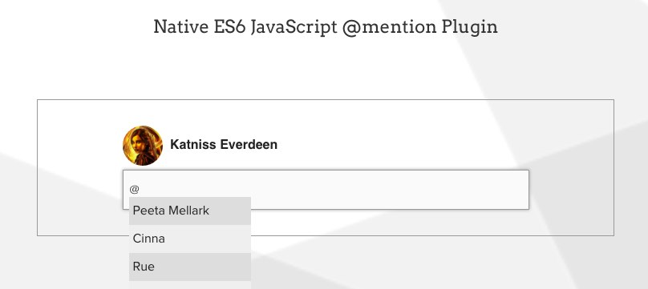

Link-link pilihan #5 untuk 2-7 Mei 2016. Nemu link unik atau artikel menarik? kalao saya iya, berikut link-link pilihan untuk tgl 2 sampai dengan 7 mei 2016.

## [JSTips](http://www.jstips.co/)

Jstips adalah situs kumpulan tips-tips dan snippet-snippet code javascript. Tips-tips mulai dari konsep dasar sampai optimasi script javascript.

## [tota11y](http://khan.github.io/tota11y/)

Jika anda mempunyai concern lebih terhadap accessibility web, mungkin library Javascript ini bisa membantu anda untuk mengetahui kekurangan-kekurangan web kita dari segi accessibility. Seperti tag img yang tidak memiliki alt text, atau alt text yang harus mendeskripsikan image yang bersangkutan. Atau menunjukkan error dari segi hierarki heading dan lain sebagainya.

## [boxy-svg](http://boxy-svg.com/main.html#demo)

Terlalu berat buka Adobe Illustrator untuk membuat ilustrasi SVG sederhana? Coba Boxy SVG. Boxy SVG adalah Aplikasi Chrome berbasis web untuk membuat ilustrasi dalam format SVG.

## [Fontea](https://fontea.madebysource.com/)

Font-font yang ada di Google Fonts memang bagus-bagus, tapi kadang kita malas untuk mendownload font yang diinginkan untuk digunakan dalam proses desain. Fontea adalah extensi untuk Adobe Photoshop dan Sketch (Coming Soon) yang berfungsi sebagai Google Font Picker. Jadi anda tidak perlu mendownload satu-satu file font dari google, anda tinggal pilih saja font yang ingin dipakai dari window Fontea

## [Animated heat distortion effects webgl](http://tympanus.net/codrops/2016/05/03/animated-heat-distortion-effects-webgl)

Tutorial menarik dari codrops untuk membuat ilusi distorsi pada gambar. Dengan menggunakan teknologi webgl dan canvas, anda akan mempelajari bagaimana menggunakan kedua teknologi tersebut untuk menambahkan efek menarik pada gambar kita. Misalnya efek fatamorgana, Riak Air dan lain sebagainya.

## [Styling text with SVG filters](https://www.codeschool.com/blog/2016/04/21/styling-text-with-svg-filters/)

Untuk menambahkan text kita bisa menggunakan Text-shadow, text outline ganti font dan lain sebagainya, namun pernahkan anda mencoba memberikan style pada text dengan bantuan SVG? di artikel ini anda akan mempelajarinya. Styling text untuk mendekati text yang ada dalam desain uang dollar.

## [Flexboxgrid](http://flexboxgrid.com/)

Setelah anda belajar flexbox mungkin anda akan berfikir, kayaknya mudah juga bikin grid system dengan flexbox. Well, kemarin saya nemu grid berbasis flexbox. Silahkan dicoba-coba

## [Overapi](http://overapi.com/)

Overapi adalah situs kumpulan cheatsheet dari berbagai bahasa pemrograman, CMS, Library atau plugin.

## [ResponsifyJS](https://github.com/wentin/ResponsifyJS)

Mengatur agar image responsif tidak kehilahan focus point itu memang susah, tapi dengan ResponsifyJS kita bisa mengatur dimana focus point image, so dalam posisi responsive, image tetap menampilkan fokus utama yang telah kita definisikan.

## [UIinteractions](https://uiinteractions.com)

Satu lagi sumber inspirasi untuk User Interface Design, UI Interactions adalah koleksi Interaksi User Interface. Jika anda sedang mencari-cari inspirasi tentang bagaimana interaksi terhadap UI, mungkin anda bisa menemukannya disitus ini.

## [Tribute](http://zurb.com/playground/tribute)

Tribute adalah library js semacam autocomplete untuk mention. Jika anda pernah bermain di stackoverflow anda mungkin pernah memention salah seorang user dengan symbol @ lalu muncul suggestion user yang ingin dimention.

