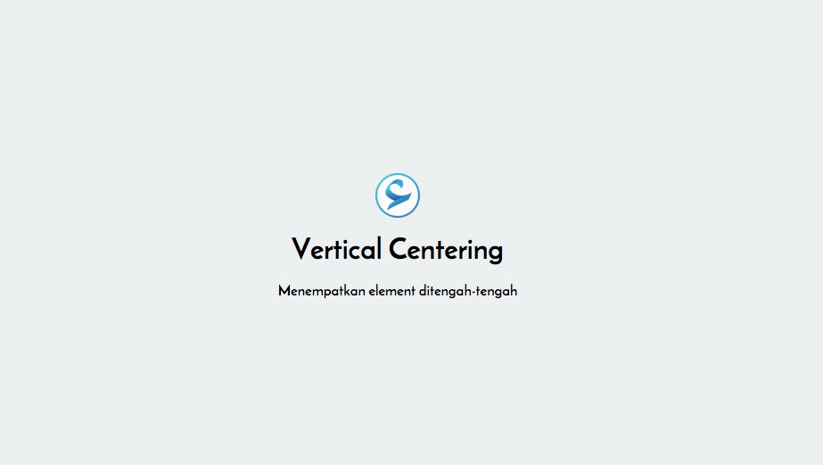
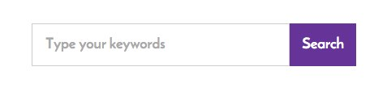
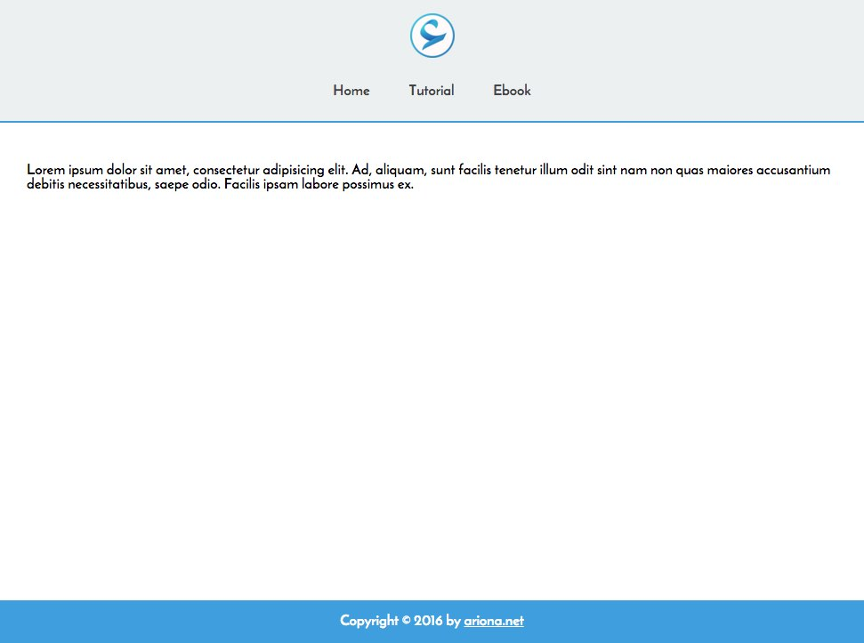
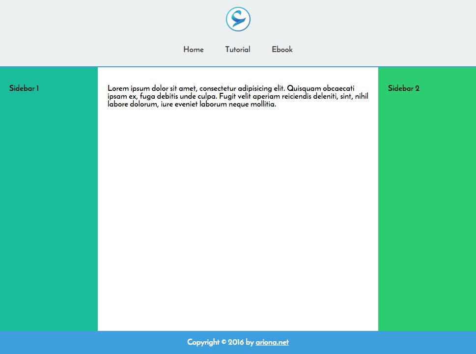
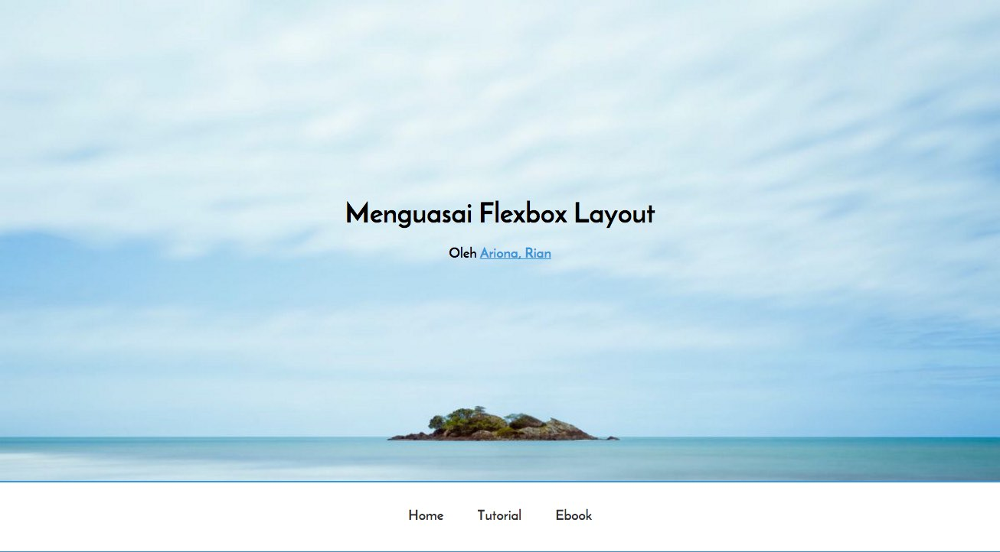
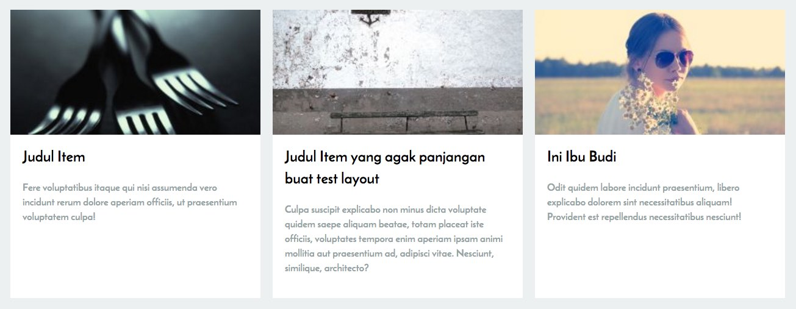

Setelah kita mempelajari dasar dari penggunaan property-property Flexbox, dan memahami konsep dari flexbox. Di tutorial kali ini kita mulai menerapkan apa yang telah kita pelajari, pada studi kasus flexbox layout.

Ada 6 Studi kasus yang akan kita pelajari di tutorial ini, Semoga dengan adanya studi kasus ini, anda bisa lebih memahami akan fungsi flexbox serta mengetahui kapa kita bisa menerapkan flexbox.

Saya juga telah menambahkan setiap study kasus di repository penunjang untuk tutorial ini, yang bisa anda download di

[Download File Penunjang](https://github.com/ariona/tutorial-flexbox-layout/)

Syntax CSS  yang ada pada tutorial ini telah disederhanakan untuk memuat property-property yang menjadi fokus utama, Untuk Style lengkapnya bisa anda download di link diatas.

## Study Kasus 1: Vertical Center

[](http://ariona.github.io/tutorial-flexbox-layout/study-kasus-1-vertical-center/)

Meletakkan element tepat ditengah item

Ada bermacam-maca cara untuk memposisikan element tepat berada ditengah-tengah containernya. Salah satunya adalah dengan melibatkan position absolute, margin dan transform.

Namun dengan flexbox kita bisa dengan mudah meletakkan element tepat ditengah-tengah containernya.

Untuk demonstrasinya, berikut saya telah menyediakan markup HTML.

```html
<div class="element">
    <h1>Vertical Centering</h1>
    <p>Menempatkan element ditengah-tengah</p>
</div>
```

Yang akan kita lakukan adalah meletakkan .element tepat ditengah-tengah body. Jadi Stylenya seperti berikut:

```css
body {
    height: 100vh;
    display: flex;
    align-items: center;
    justify-content: center;
}
.element{ text-align: center }
```

Pertama kita tentukan tinggi dari containernya, dalam kasus ini body menjadi 100vh alias sama tinggi dengan tinggi viewport/browser.

Lalu kita terapkan display: flex dengan nilai align-items dan justify-content diatur menjadi center.

Hasilnya element tadi akan berada tepat ditengah-tengah body/containernya.

## Study Kasus 2 : Search Form

Kita biasa menemukan desain searh form seperti gambar dibawah ini:

[](http://ariona.github.io/tutorial-flexbox-layout/study-kasus-2-search-form/)

Simple Search From

Yang biasa kita lakukan untuk membuatnya adalah dengan menerapkan nilai persen pada input. Atau menggunakan display table. Atau menerapkan width fix.

Semua metode tersebut memiliki kekurangan yakni Text akan terpotong ketika textnya lebih panjang dari widthnya tombolnya.

Yang ingin kita pecahkan adalah:  
\* Input text memiliki width otomatis memenuhi container  
\* Tombol Search memiliki width sesuai panjang textnya.

Kalau anda sudah benar-benar paham tentang flexbox pasti akan lengsung terbaya solusinya :)

Berikut contoh markup HTMLnya:

```html
<form class="search-form">
    <input type="text" placeholder="Type your keywords">
    <input type="submit" value="Search">
</form>
```

Dan berikut style yang digunakan

```css
.search-form{
    width: 400px;
    display: flex;
}

.search-form input[type="text"]{
    flex: 1;
}
```

Pada contoh diatas, saya tentukan width dari search-formnya menjadi 400px. Jika anda rubah menjadi lebih besar pun, ukuran text input akan otomatis membesar dan text dalam button submitnya pun tidak terpotong.

## Study Kasus 3 : Sticky Footer

[](http://ariona.github.io/tutorial-flexbox-layout/study-kasus-3-sticky-footer/)

Layout website dengan footer tetap berada dibawah

Pernahkan anda mengalami kasus untuk menempatkan footer dibawah **Meskipun** Isi dari kontennya sedikit?

Dengan layouting non flexbox, kita biasa mendapatkan footer ikut ke atas karena content dari situs sedikit/kosong sedangkan tinggi browser lebih besar dari tinggi keseluruhan situsnya. Jadinya ada area kosong dibawah footer.

Untuk meyelesaikan masalah tersebut kita bisa menerapkan flexbox layout.

```html
<header>
    <a href="#" class="logo"></a>

    <nav>
        <a href="#">Home</a>
        <a href="#">Tutorial</a>
        <a href="#">Ebook</a>
    </nav>

</header>

<main>
    <p>Lorem ipsum dolor sit amet, consectetur adipisicing elit. Ad, aliquam, sunt facilis tenetur illum odit sint nam non quas maiores accusantium debitis necessitatibus, saepe odio. Facilis ipsam labore possimus ex.</p>
</main>

<footer>
    <p class="colophon">Copyright © 2016 by <a href="http://ariona.net">ariona.net</a></p>
</footer>
```

Markup Diatas, adalah markup sederhana untuk merepresentasikan Header, Content dan Footer.

Berikut contoh penggunaan flexbox untuk menyelesaikan masalah tersebut:

```css
body{
    display: flex;
    flex-direction: column;
    min-height: 100vh;
}

main{
    flex: 1;
}
```

Pada css di atas, kita atur agar tinggi body minimal sama dengan tinggi viewport/browser. Jadi meskipun contennya sedikit body akan tetap memiliki tinggi 100%.

> Untuk mempelajari tentang viewport unit kamu bisa baca artikel saya yang ini [/mengenal-css3-viewport-unit/](/mengenal-css3-viewport-unit/)

Lalu kita terapkan display flex dengan direction Column, agar layout kita tersusun secara vertical.

Yang menjadi trik untuk meyelesaikan masalah ini adalah, menambahkan flex-grow pada main. Dengan demikian `main` akan menghabiskan sisa kekosongan dari body, sengga footer akan tetap berada dibawah meskipun isi dari `main` kosong/sedikit.

## Study Kasus 4: Layout 3 Kolom

[](http://ariona.github.io/tutorial-flexbox-layout/study-kasus-4-layout-3-kolom/)

Layout Website 3 Kolom

Untuk membuat Layout 3 kolom, tentunya banyak cara yang bisa kita gunakan. Misalnya dengan menggunakan persentase dan floating, Atau bahkan menggunakan table layout.

Melanjutkan Study kasus sebelumnya, kita akan rubah bagian content/`main` menjadi 3 area.

```html
<main>
    <aside class="sidebar-1">
        <p>Sidebar 1</p>
    </aside>
    <article>
        <p>Lorem ipsum dolor sit amet, consectetur adipisicing elit. Quisquam obcaecati ipsam ex, fuga debitis unde culpa. Fugit velit aperiam reiciendis deleniti, sint, nihil labore dolorum, iure eveniet laborum neque mollitia.</p>
    </article>
    <aside class="sidebar-2">
        <p>Sidebar 2</p>
    </aside>
</main>
```

Selanjutnya kita terapkan style baru pada `main`

```css
main{
    flex: 1;

    /* Kita jadikan main ini flex container */
    display: flex;
}

aside{
    flex-basis: 200px;
    flex-shrink: 0;
}
article{
    flex-grow: 1;
}
```

Kita atur `aside` untuk memiliki width 200px dengan shrink 0 agar widthnya tetap tidak berkurang ketika containernya mengecil.

Lalu kita atur agar `article` agar memnuhi sisa ruang kosong dengan flex-grow: 1.

Yang lebih menarik dari penerapan flexbox pada kasus ini adalah pengaturan ketika responsive.

Bagaimana jika ketika responsive, si sidebar 1 harus pindah posisi menjadi dibawah `article`?. Dengan markup diatas, karena urutan penulisannya sidebar lalu main. Maka akan sulit untuk memindahkan sidebar1 dibawah main.

Dengan flexbox kita bisa bermain dengan order untuk memindahkan posisi sidebar tersebut:

```css
@media screen and (max-width: 768px){

    main{
        /* Rubah Flex-direction menjadi Kolom */
        flex-direction: column;
    }
    aside{
        /* Atur flex basis menjadi auto */
        flex-basis:auto;
    }
    /* Ubah posisi sidebar-1 menjadi dibawah konten */
    .sidebar-1{order: 1}
    /* Ubah posisi sidebar-2 menjadi dibawah sidebar 1 */
    .sidebar-2{order: 2}
}
```

Dan sekarang pada ukurang 768px ke bawah, layout akan dirubah menjadi vertical, dan sidebar-1 akan berada dibawah `article`.

## Study Kasus 5: Hero Cover

[](http://ariona.github.io/tutorial-flexbox-layout/study-kasus-5-hero-cover/)

Hero Cover Page

Pada kasus ini, kita ingin agar cover image memiliki tinggi memenuhi layar, namun masih menyisakan ruang untuk navigation bar.

Untuk penyelesainnya kita bisa bermain-main dengan function calc untuk kalkukasi height dan penggunaan viewport unit.

Namun bagaimana jika tinggi navigation-barnya lebih besar atau lebih kecil?

Kasus-kasus seperti inilah yang memang harus menjadi pertimbangan. Bagaimana kalau itunya kecil, itunya gede, trus gimana ngitung heightnya :D.

_well_, Dengan flexbox kita tinggal menggunakan flexgrow pada cover imagenya. Selesain urusan :D.

```html
<div class="hero">
    <div class="cover">
        <h1>Menguasai Flexbox Layout</h1>
        Oleh <a href="http://ariona.net">Ariona, Rian</a>
    </div>
    <nav class="navigation">
        <a href="#">Home</a>
        <a href="#">Tutorial</a>
        <a href="#">Ebook</a>
    </nav>
</div>

<article>
    <p>Lorem ipsum dolor sit amet, consectetur adipisicing elit. Alias, eum distinctio! Eaque, inventore vero soluta repellat veritatis incidunt autem atque et, minus in, ratione commodi optio voluptates deserunt eligendi esse recusandae voluptate, natus id ab! Debitis numquam tempore, dignissimos cum quo maiores, maxime veniam! Ea dolores nulla, dicta exercitationem aliquam!</p>
    <p>Soluta dolore corrupti eveniet error assumenda. Illo molestiae, quo rerum cumque numquam explicabo excepturi tempore. Ullam totam ea inventore vero odit exercitationem debitis repellendus, numquam, aut amet sit dolores doloribus maiores vitae repellat dolorem eos, ipsum deserunt dolore provident. Expedita inventore aliquid omnis obcaecati ipsam modi ducimus officiis, dignissimos vel!</p>
    <p>Dolorem inventore ad fugiat odio, impedit molestiae similique delectus, perferendis tenetur ratione tempora excepturi a fugit reprehenderit, aspernatur placeat quam nisi eos distinctio repellendus nesciunt unde minima nam, sint. Velit excepturi totam sunt consectetur sapiente a libero, harum expedita quaerat, cupiditate necessitatibus commodi animi tempore, quod veniam id pariatur quisquam!</p>
    <p>Nostrum tempora, temporibus vel laboriosam cumque aliquam, excepturi eligendi nemo pariatur, nihil aut dicta ad sapiente iure perferendis. Maiores veniam in facere, et at. Cumque aliquid ullam quos incidunt nesciunt ipsa totam quo? Doloribus expedita, fugit facilis animi saepe, velit laborum ex quia voluptas delectus sint dolore omnis in id.</p>
    <p>Molestias exercitationem necessitatibus repellat voluptatem, voluptatibus a numquam praesentium saepe nostrum unde fuga, eveniet quia. Eum nemo iste dicta quam facere quasi, velit rem. Dicta quia sunt quasi quam nisi nam eligendi deserunt fugiat, vel iure odit praesentium reiciendis impedit tempore natus commodi ipsa enim quod, perferendis laboriosam nesciunt eaque.</p>
</article>
```

Style untuk studi kasus ini:

```css
.hero {
    height: 100vh;
    min-height: 640px;

    display: flex;
    flex-direction: column
}
.cover{
    flex: 1;
}
```

## Study Kasus 6 : Menyamakan tinggi Item

[](http://ariona.github.io/tutorial-flexbox-layout/study-kasus-6-menyamakan-tinggi-item/)

Grid Layout dengan tinggi item sama

Salah satu kekurangan ketika menggunakan floating untuk layouting adalah tinggi setiap item tidak bisa sama. Kalau kita ingin setiap item memiliki tinggi yang sama kita harus memutar otak lagi.

Apakah menggati layoutnya dengan table layout? atau menggunakan javascript untuk mendeteksi item mana yang paling tinggi lalu atur tinggi item lainnya.

Dengan flexbox, karena memang bawaan dari align-items nya stretch maka setiap item akan memiliki tinggi yang sama.

Berikut markup untuk study kasus ini.

```html
<div class="card-list">
    <div class="card">
        <div class="card__image"></div>
        <div class="card__content">
            <h2 class="card__title">Judul Item</h2>
            <div class="card__desc">
                Fere voluptatibus itaque qui nisi assumenda vero incidunt rerum dolore aperiam officiis, ut praesentium voluptatem culpa!
            </div>
        </div>
    </div>

    <div class="card">
        <div class="card__image"></div>
        <div class="card__content">
            <h2 class="card__title">Judul Item yang agak panjangan buat test layout</h2>
            <div class="card__desc">
                Culpa suscipit explicabo non minus dicta voluptate quidem saepe aliquam beatae, totam placeat iste officiis, voluptates tempora enim aperiam ipsam animi mollitia aut praesentium ad, adipisci vitae. Nesciunt, similique, architecto?
            </div>
        </div>
    </div>

    <div class="card">
        <div class="card__image"></div>
        <div class="card__content">
            <h2 class="card__title">Ini Ibu Budi</h2>
            <div class="card__desc">
                Odit quidem labore incidunt praesentium, libero explicabo dolorem sint necessitatibus aliquam! Provident est repellendus necessitatibus nesciunt!
            </div>
        </div>
    </div>

    <div class="card">
        <div class="card__image"></div>
        <div class="card__content">
            <h2 class="card__title">Budi Ditemukan Disemak belukar</h2>
            <div class="card__desc">
                Odit quidem labore incidunt praesentium, libero explicabo dolorem sint necessitatibus aliquam! Provident est repellendus necessitatibus nesciunt!
            </div>
        </div>
    </div>
</div>
```

Style yang digunakan:

```css
.card-list{

    display: flex;
    flex-flow: row wrap;

}

.card{
    margin: 10px;
    background-color: white;

    /* Mengatur width dengan persen dikurangi margin */
    width: calc( 33.333% - 20px);
}
```

Meskipun isi content dari setiap item berbeda sehingga menyebabkan perbedaan tinggi item, dengan Flexbox setiap item dapat dipaksa untuk menyamakan tingginya tanpa Perlu javascript :D

## Penutup Tutorial Flexbox

Oke, Ini adalah artikel terakhir dari seri Tutorial Menguasai Flexbox Layout. Di [bagian pertama](/menguasai-flexbox-layout/) kita telah mempelajari tentang dasar flexbox, di [bagian kedua](/menguasai-flexbox-layout-bagian-2/) kita mendalami pula cara mengatur ukuran flex item dan dibagian ketiga ini ditutup dengan Study Kasus.

Semoga tutorial berseri ini dapat membuat anda memahami cara penggunaan flexbox layout dan mampu menerapkannya dalam projek yang sedang anda kerjakan.

## Referensi dan Website Penunjang

1. [W3C Flexbox Specification](https://www.w3.org/TR/css-flexbox-1/)
2. [Mozilla Developer Network: Flexbox Layout](https://developer.mozilla.org/en-US/docs/Web/CSS/CSS_Flexible_Box_Layout/Using_CSS_flexible_boxes)
3. [CSS-tricks : Flexbox Snippets](https://css-tricks.com/snippets/css/a-guide-to-flexbox/)
4. [Game Flexbox Katak](http://flexboxfroggy.com/)
5. [Game Flexbox Defense](http://www.flexboxdefense.com/)
