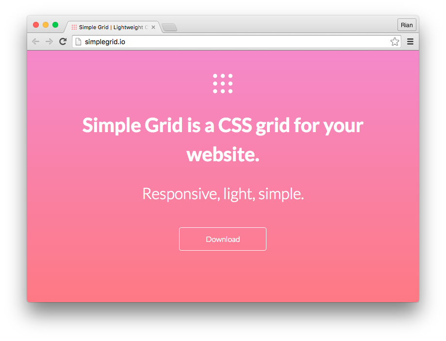
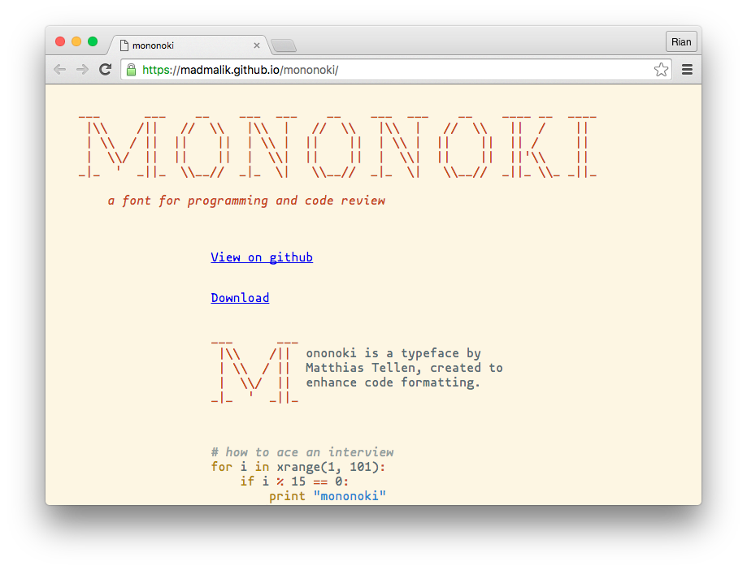
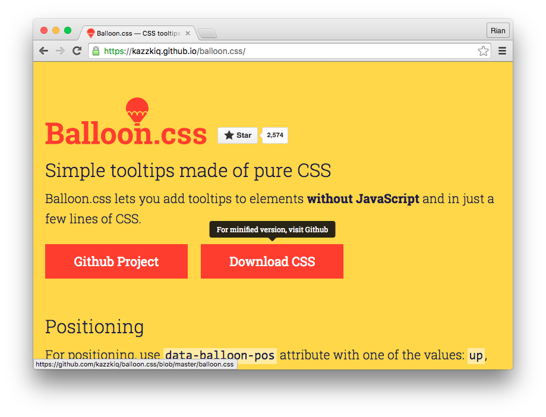
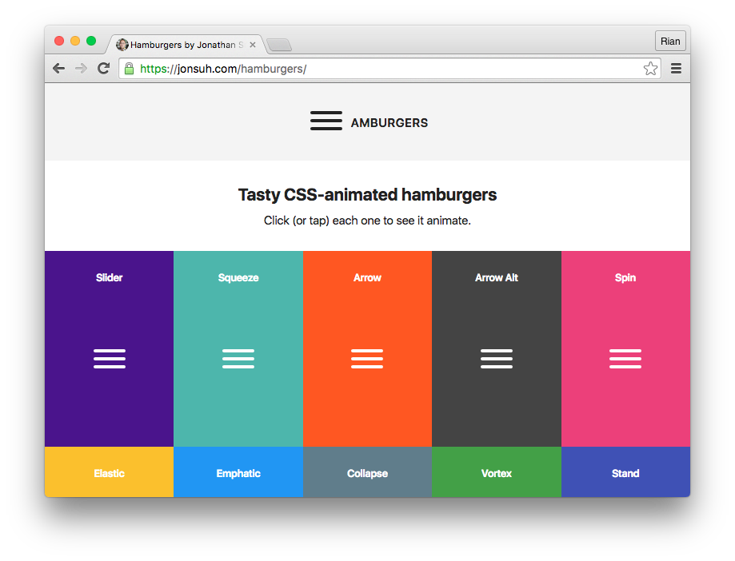
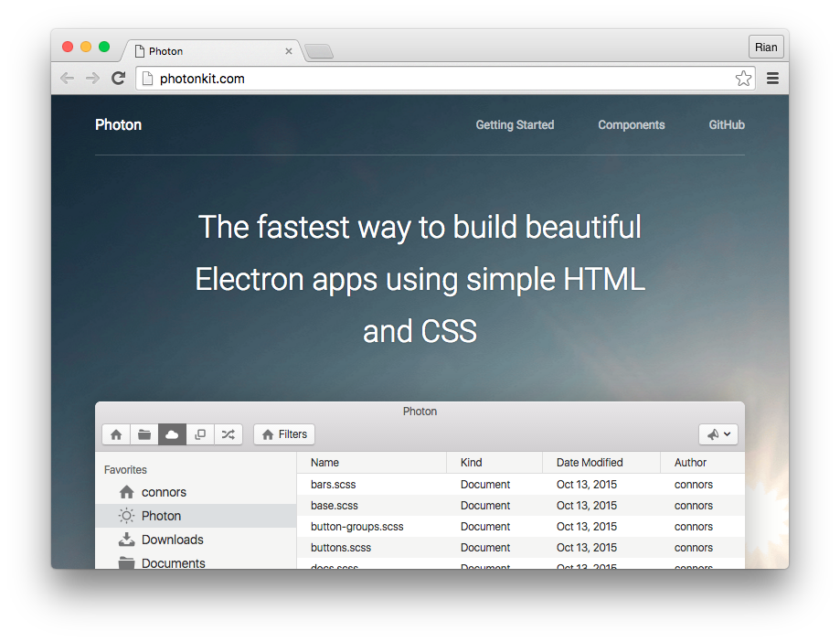
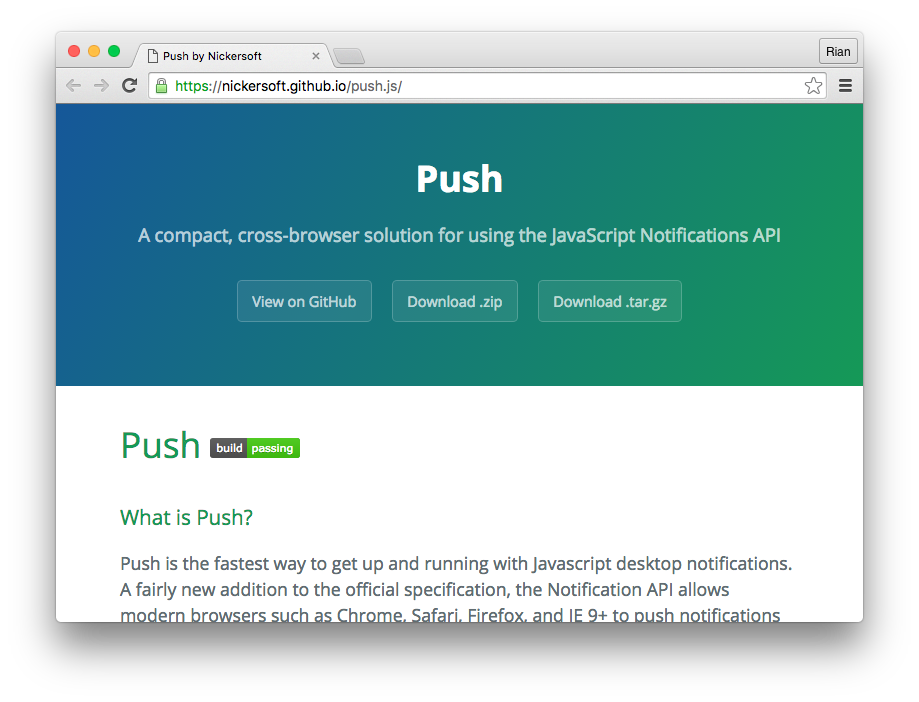
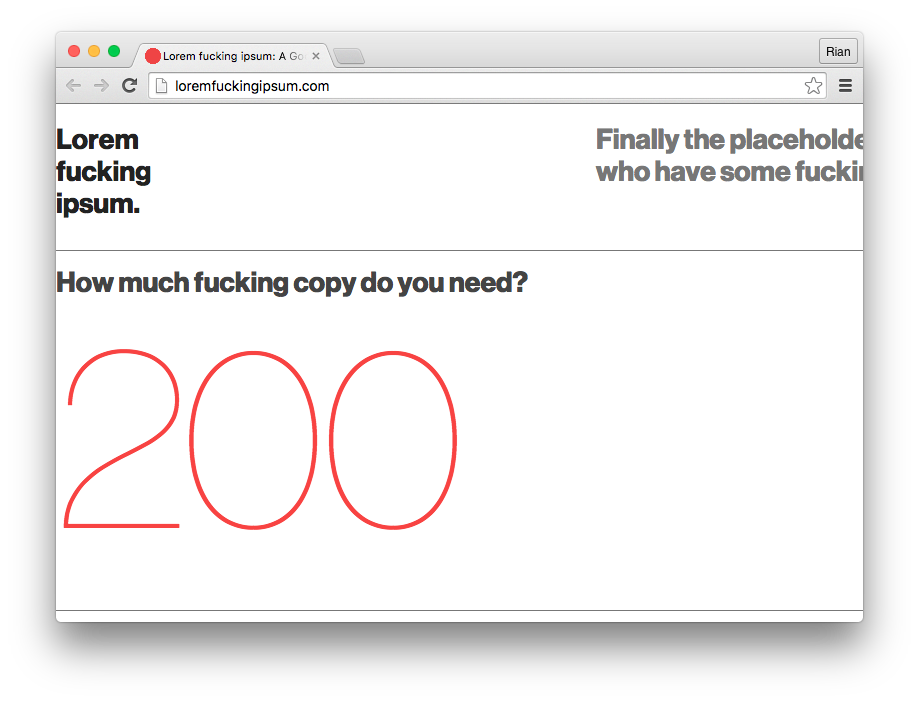
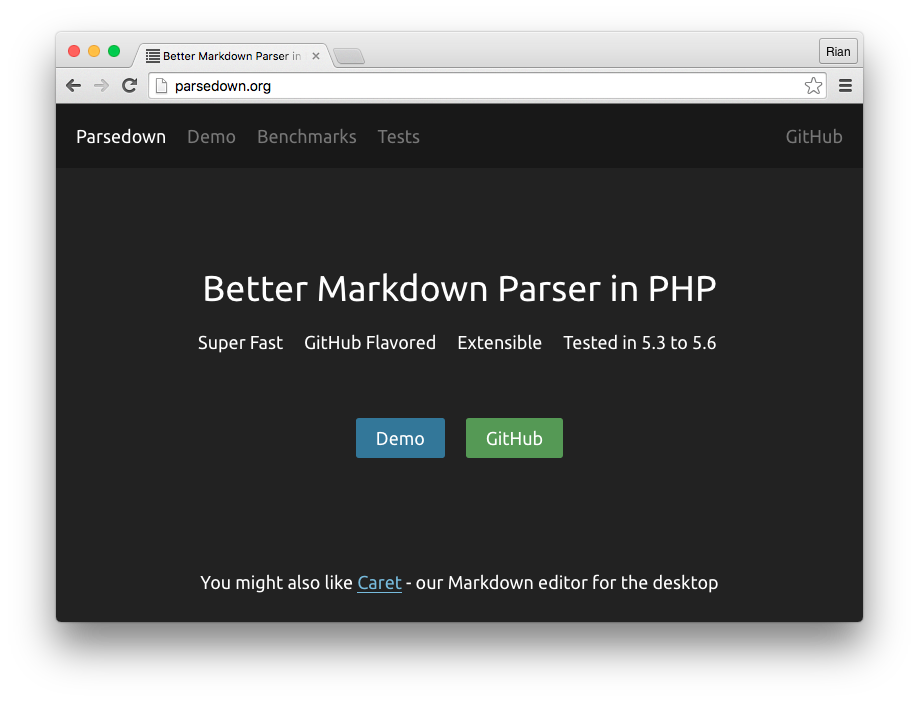

Duh, maaf telat publish. kemarin agak gak enak badan :-( , Link-link pilihan minggu kemarin. Semoga memberikan inspirasi dan informasi menarik :D

## [Simplegrid](http://simplegrid.io/)

Library yang hanya berisi Grid saja, cocok untuk anda yang membutuhkan library grid sederhana.

## [Mononoki](http://madmalik.github.io/mononoki/)

Font monospace gratis, cocok untuk teks editornya para developer :)

## [Balloon.css](https://github.com/kazzkiq/balloon.css)

CSS Tooltip library, tanpa perlu javascript, cukup tambahkan class dan data attribute.

## [Hamburgers](https://github.com/jonsuh/hamburgers)

Butuh inspirasi hamburger menu? Coba library Hamburgers, untuk berbagai animasi unik hamburgers menu.

## [Photonkit](http://photonkit.com/)

Untuk anda yang sedang membuat aplikasi desktop berbasis web dan ingin memiliki UI a la OS X, Anda bisa mencoba PhotonKit.

## [Push.js](http://nickersoft.github.io/push.js/)

PushJs adalah library javascript untuk membuat push notification cross platform (windows, linux & OS X).

## [Loremfuckingipsum](http://loremfuckingipsum.com/)

Butuh teks generator kaya lorem ipsum tapi dengan kata-kata manusiawi :D coba ini.

## [Swite](https://swite.com)

Jadiin status facebook/page facebook mu menjadi situs mandiri. Cukup login dengan facebook, pilih yang mau dijadiin situs, profile atau page dan generate. Jadideh situsnya.

## [AMA with Chris Coyier](https://hashnode.com/ama/with-chris-coyier-cinbiuq3s00148i534gxu4me3)

Kemarin nyari-nyari library parsi markdown pake PHP dan nemu ini. Bisa dijadiin referensi juga :)
