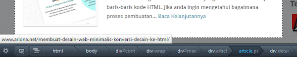
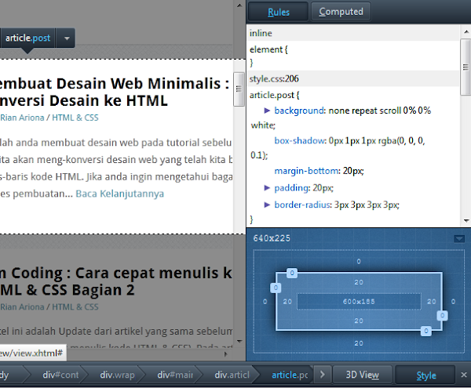
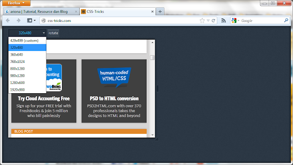
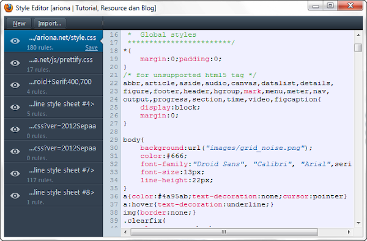

Belum lama ini firefox telah merilis versi terbarunya, yakni versi 15. Ada beberapa penambahan fitur yang lebih menitik beratkan pada Web Developer dan semua fitur tersebut memang sangat membantu. Disini saya akan membahas semua fitur penting web developer yang terdapat dalam firefox.

## Inspect

Pada versi lama, firefox tidak memiliiki fitur untuk meng-inspect element-element HTML, maka dari itu perlu [add-on tambahan seperti firebug](/tutorial-firebug) untuk memenuhi kebutuhan tersebut. Namun kini firefox menyematkan fitur Inspect element pada versi terbarunya.

Inspect berfungsi untuk menginspeksi element HTML sesuai dengan elemen yang dipilih oleh user atau yang ditunjuk oleh kursor. Struktur element akan ditampilkan dibagian bawah browser (berupa breadcrumbs).

Dibagian kiri terdapat tombol style untuk mengaktifkan Panel style yang akan menampung berbagai rule/style yang diterapkan pada elemen yang terpilih.

Panel Style sendiri terbagi menjadi 2 bagian (Tab), Rules untuk menampilkan style dari file CSS yang digunakan dalam webpage dan Computed untuk menampilkan style hasil komputasi (meliputi default style, atau hasil perhitungan komputer-untuk ukuran, warna dll)

## Responsive Design View

Pada firefox 15 ada tool yang menarik, yakni Responsive Design View. fitur ini akan membuat browser menampilkan halaman web berdasarkan ukuran dari berbagai resolusi layar, mulai dari handheld sampai widescreen.

Fitur ini memudahkan anda untuk pengujian [Responsive Design](/responsive-webdesign-apa-dan-bagaimana/ "Responsive Webdesign, Apa dan Bagaimana ?") tanpa harus me-resize Jendela Browser anda. Anda tinggal memilih resolusi yang tersedia, atau me-resize grip sesuai dengan ukuran yang anda inginkan.

## Style Editor

Yang paling menyita perhatian saya adalah Style Editor. Style Editor memberikan keleluasaan bagi Anda dalam mengedit file CSS -Langsung di dalam Browser. Biasanya saya sering menggunakan aplikasi seperti CSSDesk, atau bahkan [membuat Live Text Editor sendiri](/membuat-live-html-css-text-editor/). Yang menarik adalah, ketika suatu property berubah, firefox menampilkannya dengan sedikit efek transisi-sangat enak dipandang :)

Fitur ini memungkinkan anda untuk membuat file CSS baru dan menyimpannya dalam komputer anda dan pastinya setiap perubahan pada syntax CSS, hasilnya bisa anda perhatikan pada browser secara langsung/live.

## Javascript Debugging

Tool-tool lainnya adalah tool yang berhubungan dengan Javascript, seperti Scratchpad, Debugger, dan Web Console. Semua tool tersebut berfungsi untuk membuat dan menguji Javascript pada halaman Web.

## Tool-tool tambahan

Dengan adanya dukungan Add-on, tentunya anda masih bisa menambahkan tool-tool lain yang akan memperkaya fungsionalitas firefox anda. Anda masih bisa menggunakan firebug jika anda masih kurang _"sreg"_ dengan tool bawaan dari firefox di atas.

## Kesimpulan

Sejauh ini saya terkesan dengan penambahan fitur-fitur yang saya sebutkan di atas, terutama Style Editor (Karena memang saya sering berurusan dengan CSS). User Interfacenya-pun menarik dan berbeda (Tidak ikut-ikutan dengan developer Tool milik webkit-Chrome/Safari). Jika anda belum puas dengan fitur-fitur tersebut, Anda masih bisa menambahkan fitur lainnya lewat Add-On.
